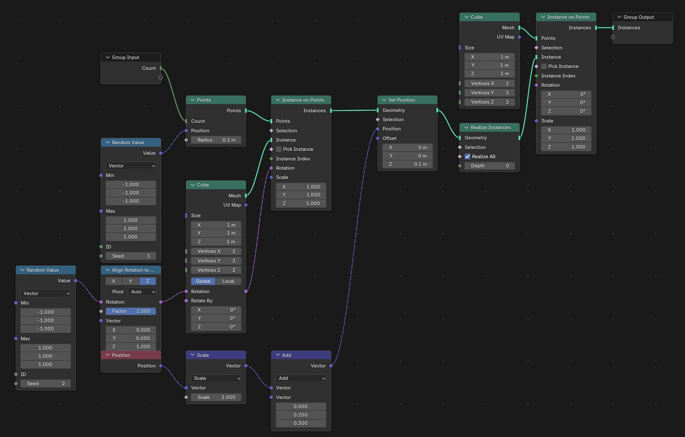

# nodebpy

A python package to help build node trees in blender more elegantly with
python code.

``` python
import bpy
from nodebpy import nodes, sockets, TreeBuilder

with TreeBuilder() as tree:
    tree.interface(
        inputs=[sockets.SocketInt("Count")],
        outputs=[sockets.SocketGeometry("Instances")],
    )

    rotation = (
        nodes.RandomValue.vector(min=(-1, -1, -1), seed=2)
        >> nodes.AlignRotationToVector()
        >> nodes.RotateRotation()
    )

    _ = (
        tree.inputs.count
        >> nodes.Points(position=nodes.RandomValue.vector(min=(-1, -1, -1)))
        >> nodes.InstanceOnPoints(instance=nodes.Cube(), rotation=rotation)
        >> nodes.SetPosition(
            position=nodes.Position()
            >> nodes.VectorMath.scale(..., 2.0)
            >> nodes.VectorMath.add((0, 0.2, 0.3)),
            offset=(0, 0, 0.1),
        )
        >> nodes.RealizeInstances()
        >> nodes.InstanceOnPoints(nodes.Cube(), instance=...)
        >> tree.outputs.instances
    )

# save as a .blendfile for inspection
mod = bpy.data.objects["Cube"].modifiers.new("TestModifier", "NODES")
mod.node_group = tree.tree
bpy.ops.wm.save_as_mainfile(filepath="example.blend")
```

    Linking from <nodebpy.nodes.manually_specified.RandomValue object at 0x322cce590> to Position
    Linking from <nodebpy.nodes.mesh.Cube object at 0x159312d10> to Instance
    Linking from <nodebpy.nodes.utilities.RotateRotation object at 0x323b53890> to Rotation
    Linking from <nodebpy.nodes.manually_specified.VectorMath object at 0x159312d10> to Position
    Linking from <nodebpy.nodes.mesh.Cube object at 0x3240b1510> to Points
    Info: Saved as "example.blend"

    {'FINISHED'}


