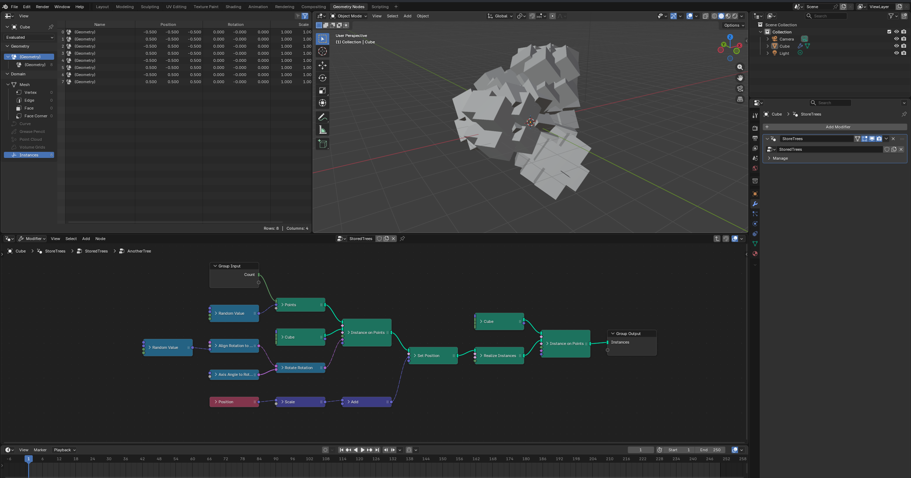

# nodebpy

[](https://github.com/BradyAJohnston/nodebpy/actions/workflows/tests.yml)
[](https://codecov.io/gh/BradyAJohnston/nodebpy)

A package to help build node trees in blender more elegantly with python code.

## The Design Idea

> A text-based version of nodes should bring the convenience of writing code with IDE auto-completion, type hinting, with overall compactness and readability, while staying as close as possible to what building a node tree via the GUI feels like.

Other projects have attempted similar but none quite handled the API how
I felt it should be done. Notable existing projects are:

- Authoring node trees with code:
  - [geometry-script](https://github.com/carson-katri/geometry-script),
  - [geonodes](https://github.com/al1brn/geonodes)
- Storing node trees as code:
  - [NodeToPython](https://github.com/BrendanParmer/NodeToPython).
  - [TreeClipper](https://github.com/Algebraic-UG/tree_clipper) (used by this project for running tests & snapshots)

Previous projects mostly implement the chaining of nodes together via class methods and chaining the `.` operator (`instance_on_points().set_position()`).

This approach is limiting - not being able to explicitly specify output sockets and input sockets while chaining.


### `nodebpy` and the `>>` operator

In `nodebpy` we use the `>>` operator to link from one node or socket into another.
This should feel and behave much like the <kbd>Alt</kbd> + <kbd>Right Click</kbd> drag between nodes in [Node Wrangler](https://docs.blender.org/manual/en/latest/addons/node/node_wrangler.html). It will use some smart logic to match the most compatible sockets between the nodes, but if you ever want to be explicit you do so. The input and output sockets of a node are accessible as properties via the `i_*` and `o_*` prefixes, or you can use the `...` placeholder to specify the particular input to be user, or pass in the previous node as a named argument.

```py
n.Vector() >> n.SetPosition().i_offset
n.Vector() >> n.SetPosition(offset=...)
n.SetPosition(offset=n.Vector())
```

The `>>` operator will always look for the _most_ compatible sockets first (matching data types) before looking for other compatible but not identical socket data types to link.
If a compatible match can't be found an error _will_ be thrown.

### Contexts
What node tree or node tree interface we are currently editing is determined based on contexts.
Instantiating a node class outside of a tree context will throw an error. The easiest way to enter and exit a tree context is to use the `with` statement.

Each time you instantiate a node class, a new node will be created and added to the current tree.
If these nodes are given as arguments to other nodes or used with the `>>` operator, they will be automatically linked to the appropriate sockets.

Entering the `tree.inputs` and `tree.outputs` contexts will let you add new interface sockets to the node tree for usage as a modifier or as a node group in another node tree. These also return an object that can be used as arguments to other nodes or with the `>>` operator for linking.

```py
with TreeBuilder("MyTree") as tree:
    points = n.Points(position=n.RandomValue.vector(min=-1))
    with tree.outputs:
        points >> s.SocketGeometry("New Points")
```

# Example Node Tree

The node tree below creates a integer input and geometry output to the node group. We create a `rotation` variable that can be used later on as an argument, then construct a longer chain of nodes being created and linked together. The nodes are added and linked as each node is instantiated. After we exit the tree context, the nodes are automatically arranged.

``` python
from nodebpy import TreeBuilder, nodes as n, sockets as s

with TreeBuilder("AnotherTree", collapse=True) as tree:
    with tree.inputs:
        count = s.SocketInt("Count", 10)
    with tree.outputs:
        instances = s.SocketGeometry("Instances")

    rotation = (
        n.RandomValue.vector(min=-1, seed=2)
        >> n.AlignRotationToVector()
        >> n.RotateRotation(rotate_by=n.AxisAngleToRotation(angle=0.3))
    )

    _ = (
        count
        >> n.Points(position=n.RandomValue.vector(min=-1))
        >> n.InstanceOnPoints(instance=n.Cube(), rotation=rotation)
        >> n.SetPosition(
            position=n.Position() * 2.0 + (0, 0.2, 0.3),
            offset=(0, 0, 0.1),
        )
        >> n.RealizeInstances()
        >> n.InstanceOnPoints(n.Cube(), instance=...)
        >> instances
    )
```



## Nodes

Documentation for all of the nodes can be found in the [API Reference](https://bradyajohnston.github.io/nodebpy/reference/). This is mostly built automatically from the existing Blender node classes.

Every node has all of it's input sockets and enum options exposed as arguments to the class constructor. Input sockets are prefixed with `i_` and output sockets are prefixed with `o_`. Properties that aren't exposed as sockets are available as class properties. Many properties are also available as class methods for convenience when constructing.

The basic math operators also automatically add relevant nodes with their operations and values set.

```py
# operation is exposed as a property
math = n.Math(1.0, 2.0, operation='ADD')
math.operation = "SUBTRACT"

# operation can be chose as a class method
math = n.Math.subtract(1.0, 2.0)
math = n.Math.add(1.0, 2.0)

# these are equivalent, the n.Math.multiply is automatically added
n.Value(1.0) * 2
n.Math.multiply(n.Value(1.0), 2.0)
```

# Design Considerations

Whenever possible, support IDE auto-complete and have useful types.
We should know as much ahead of time as possible if our network will actually build.

- Stick as closely to Geometry Nodes naming as possible
  - `RandomValue` creates a random value node
    - `RandomValue.vector()` creates it set to `"VECTOR"` data type and
      provides arguments for IDE auto-complete
- Inputs and outputs from a node are prefixed with `i_*` and `o_`:
  - `AccumulateField().o_total` returns the output `Total` socket
  - `AccumulateField().i_value` returns the input `Value` socket
- If inputs are subject to change depending on enums, provide separate
  constructor methods that provide related inputs as arguments. There
  should be no guessing involved and IDEs should provide documentation
  for what is required:
  - `TransformGeometry.matrix(CombineTrasnsform(translation=(0, 0, 1))`
  - `TransformGeoemtry.components(translation=(0, 0, 1))`
  - `TransformGeometry(translation=(0, 0, 1))`

## Building

Most node classes are generated automatically with this. The nodes in
`nodes/manual.py` are currently manually specified due to varying
complexities of particular nodes (usually lergacy).

``` bash
uv run generate.py && ruff format && ruff check --fix --unsafe-fixes
```
