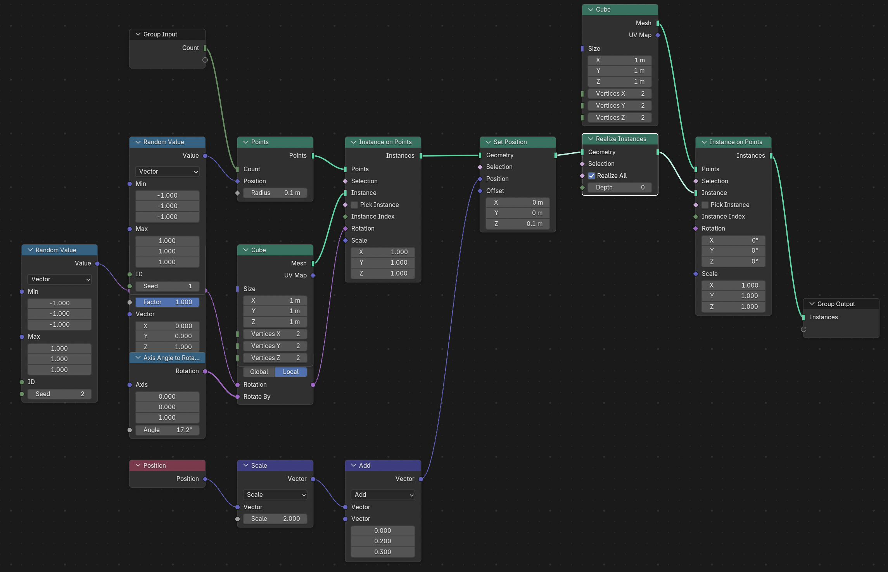

# Example Node Tree


# nodebpy

A package to help build node trees in blender more elegantly with python
code.

## The Design Idea

Other projects have attempted similar but none quite handled the API how
I felt it should be done. Notable existing projects are
[geometry-script](https://github.com/carson-katri/geometry-script),
[geonodes](https://github.com/al1brn/geonodes),
[NodeToPython](https://github.com/BrendanParmer/NodeToPython).

Other projects implement chaining of nodes mostly as dot methos of nodes
to chain them (`InstanceOnPoints().set_position()`). This has the
potential to crowd the API for individual nodes and easy chaining is
instead approached via overriding the `>>` operator.

### Chain Nodes with `>>`

By default the operator attempts to link the first output of the
previous node with the first input of the next. You can override this
behaviour by being explicit with the socket you are passing out
(`AccumulateField().o_total`) or using the `...` for the inputs into the
next node. The dots can appear at multiple locations and each input will
be linked to the previous node via the inferred or specified socket.

``` python
import bpy
from nodebpy import TreeBuilder
from nodebpy import nodes as n
from nodebpy import sockets as s

with TreeBuilder("NewTree") as tree:
    n.NamedAttribute("test", "INT") >> n.Math.power(2, ...)
```

``` python
bpy.ops.wm.read_homefile()

with TreeBuilder("AnotherTree") as tree:
    tree.interface(
        inputs=[s.SocketInt("Count")],
        outputs=[s.SocketGeometry("Instances")],
    )

    rotation = (
        n.RandomValue.vector(min=(-1, -1, -1), seed=2)
        >> n.AlignRotationToVector()
        >> n.RotateRotation(
            rotate_by=n.AxisAngleToRotation(angle=0.3), rotation_space="LOCAL"
        )
    )

    _ = (
        tree.inputs.count
        >> n.Points(position=n.RandomValue.vector(min=(-1, -1, -1)))
        >> n.InstanceOnPoints(instance=n.Cube(), rotation=rotation)
        >> n.SetPosition(
            position=n.Position() * 2.0 + (0, 0.2, 0.3),
            offset=(0, 0, 0.1),
        )
        >> n.RealizeInstances()
        >> n.InstanceOnPoints(n.Cube(), instance=...)
        >> tree.outputs.instances
    )

# save as a .blendfile for inspection
mod = bpy.data.objects["Cube"].modifiers.new("TestModifier", "NODES")
mod.node_group = tree.tree
bpy.ops.wm.save_as_mainfile(filepath="example.blend")
```

    Linking from <nodebpy.nodes.utilities.AxisAngleToRotation object at 0x169df0e90> to Rotate By
    Linking from <nodebpy.nodes.manually_specified.RandomValue object at 0x140208250> to Position
    Linking from <nodebpy.nodes.mesh.Cube object at 0x1233c1d90> to Instance
    Linking from <nodebpy.nodes.utilities.RotateRotation object at 0x1058ad850> to Rotation
    Linking from <bpy_struct, NodeSocketVector("Position") at 0x3231d31d8> to Vector
    Linking from <bpy_struct, NodeSocketVector("Vector") at 0x3231d47d8> to Vector
    Linking from <nodebpy.nodes.manually_specified.VectorMath object at 0x143182650> to Position
    Linking from <nodebpy.nodes.mesh.Cube object at 0x140208250> to Points
    Info: Saved as "example.blend"

    {'FINISHED'}


