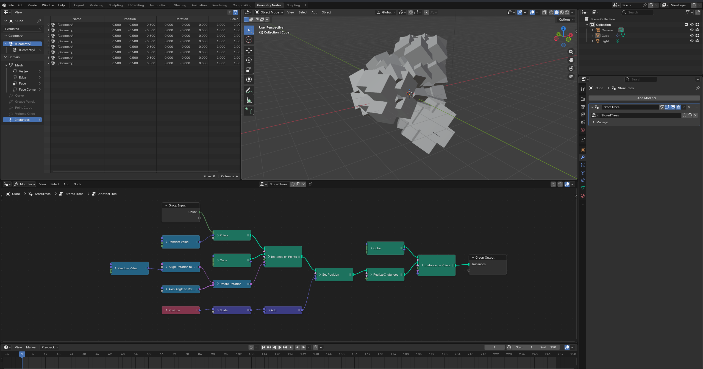

# nodebpy

[](https://github.com/BradyAJohnston/nodebpy/actions/workflows/tests.yml)
[](https://codecov.io/gh/BradyAJohnston/nodebpy)

Build node trees in Blender more elegantly with Python code. Geometry Nodes, Shader Nodes and Compositor nodes are all fully supported, with type hints and IDE auto-completion throughout.

```bash
pip install nodebpy
```

> A text-based version of nodes should bring the convenience of writing code with IDE auto-completion, type hinting, with overall compactness and readability, while staying as close as possible to what building a node tree via the GUI feels like.

```python
from nodebpy import geometry as g

with g.tree("AnotherTree", collapse=True) as tree:
    rotation = (
        g.RandomValue.vector(min=-1, seed=2)
        >> g.AlignRotationToVector()
        >> g.RotateRotation(rotate_by=g.AxisAngleToRotation(angle=0.3))
    )

    _ = (
        tree.inputs.integer("Count", 10)
        >> g.Points(position=g.RandomValue.vector(min=-1))
        >> g.InstanceOnPoints(instance=g.Cube(), rotation=rotation)
        >> g.SetPosition(
            position=g.Position() * 2.0 + (0, 0.2, 0.3),
            offset=(0, 0, 0.1),
        )
        >> g.RealizeInstances()
        >> g.InstanceOnPoints(g.Cube(), instance=...)
        >> tree.outputs.geometry("Instances")
    )
```



- Every node is a typed class named after the node it creates — 'Random Value' becomes `g.RandomValue()` — and node subtypes are class methods: `g.RandomValue.vector()`.
- Trees are built inside a `with g.tree(...):` context; instantiating a node class adds it to the current tree, and the tree's interface is declared with `tree.inputs.*` / `tree.outputs.*`.
- Nodes are linked with the `>>` operator, which picks the most compatible socket pair automatically (much like Node Wrangler's <kbd>Alt</kbd> + <kbd>Right Click</kbd> drag) — or address sockets explicitly through the `.i.*` / `.o.*` accessors.
- Python's arithmetic, comparison and boolean operators create the matching `Math` / `VectorMath` / `Compare` / `BooleanMath` nodes: `g.Value(1.0) * 2 + (0, 0, 1)`.
- Existing node trees — including ones wired up by hand in the GUI — can be exported back to `nodebpy` source with `to_python()`.

## Documentation

Guides and the full node reference live at [bradyajohnston.github.io/nodebpy](https://bradyajohnston.github.io/nodebpy):

- [Writing node trees](https://bradyajohnston.github.io/nodebpy/introduction.html) — adding, linking and organising nodes
- [Math operators](https://bradyajohnston.github.io/nodebpy/operators.html) — arithmetic, comparison and boolean expressions as nodes
- [Node API design](https://bradyajohnston.github.io/nodebpy/node-api.html) — sockets, accessors, enum options and class methods
- [Custom node groups](https://bradyajohnston.github.io/nodebpy/custom-node-groups.html) and [asset node groups](https://bradyajohnston.github.io/nodebpy/assets.html) — reusable groups as Python classes
- [Nodes to code](https://bradyajohnston.github.io/nodebpy/nodes-to-code.html) — turn existing trees back into `nodebpy` code
- [Using `nodebpy` in your add-on](https://bradyajohnston.github.io/nodebpy/using.html) — installation, bundling and the Blender-tracking versioning scheme
- [Comparisons](https://bradyajohnston.github.io/nodebpy/comparisons.html) — how the API relates to [`geometry-script`](https://github.com/carson-katri/geometry-script), [`geonodes`](https://github.com/al1brn/geonodes), [NodeToPython](https://github.com/BrendanParmer/NodeToPython) and [TreeClipper](https://github.com/Algebraic-UG/tree_clipper)

Like [`databpy`](https://github.com/BradyAJohnston/databpy), this project started as an internal tool inside [`molecularnodes`](https://github.com/BradyAJohnston/MolecularNodes) before being broken out into its own robustly typed and tested package.

## Contributing

Development setup, running the tests and regenerating the node classes (most of `src/nodebpy/nodes/` is auto-generated by the `gen/` package) are covered in [CONTRIBUTING.md](CONTRIBUTING.md).
