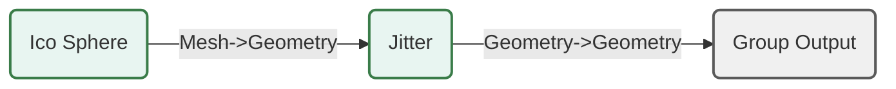

``` mermaid
graph LR
    N0("Radial Array"):::geometry-node

    classDef geometry-node fill:#e8f5f1,stroke:#3a7c49,stroke-width:2px
    classDef converter-node fill:#e6f1f7,stroke:#246283,stroke-width:2px
    classDef vector-node fill:#e9e9f5,stroke:#3C3C83,stroke-width:2px
    classDef texture-node fill:#fef3e6,stroke:#E66800,stroke-width:2px
    classDef shader-node fill:#fef0eb,stroke:#e67c52,stroke-width:2px
    classDef input-node fill:#f1f8ed,stroke:#7fb069,stroke-width:2px
    classDef output-node fill:#faf0ed,stroke:#c97659,stroke-width:2px
    classDef default-node fill:#f0f0f0,stroke:#5a5a5a,stroke-width:2px
```

# Custom Node Groups

``` python
from nodebpy import NodeGroupBuilder, geometry as g
from nodebpy.types import (
    InputFloat,
    InputInteger,
    InputVector,
    InputGeometry,
)
```

Custom node groups let you encapsulate reusable logic into a single node. With `NodeGroupBuilder`, you define a Python class that:

1.  **Declares inputs and outputs** as class-level descriptors.
2.  **Implements the internal graph** in a `_build_group` classmethod.
3.  **Works like any other node** – full IDE autocomplete, type hints, `>>` chaining, and operator support.

The group’s node tree is built once on first use and cached in `bpy.data.node_groups`, so creating many instances of the same group is cheap.

## Anatomy of a Custom Node Group

A custom node group class has four parts:

``` python
class MyNode(NodeGroupBuilder):
    _name = "My Node"  # 1. Name

    def __init__(self, value: float = 0.0):  # 3. Constructor
        super().__init__(value=value)

    @classmethod
    def _build_group(cls, tree):  # 4. Graph logic
        return (value + g.Value(1.0)) >> tree.ouptuts.float()
```

### 1. `_name`

The display name for the group inside Blender. This is also the key used to cache it in `bpy.data.node_groups`.

## A First Example: Jitter

Let’s start with something visually obvious – a node that randomly displaces each point on a mesh. This is useful any time you want to add organic variation to geometry.

``` python
class Jitter(NodeGroupBuilder):
    """Randomly offset each point by a bounded amount."""

    _name = "Jitter"
    _color_tag = "GEOMETRY"

    def __init__(
        self,
        geometry: InputGeometry = ...,
        amount: InputFloat = 0.2,
        seed: InputInteger = 0,
    ):
        super().__init__(**{"Geometry": geometry, "Amount": amount, "Seed": seed})

    @classmethod
    def _build_group(cls, tree):
        geometry = tree.inputs.geometry("Geometry")
        amount = tree.inputs.float("Amount", 0.2)
        seed = tree.inputs.integer("Seed")

        offset = g.RandomValue.vector(min=-1, seed=seed) * amount
        result = geometry >> g.SetPosition(offset=offset)

        _ = result >> tree.outputs.geometry()
```

Let’s see the internal node graph:

``` python
with g.tree("JitterInternal") as tree:
    _ = Jitter()

tree
```



``` mermaid
graph LR
    N0("Jitter"):::geometry-node

    classDef geometry-node fill:#e8f5f1,stroke:#3a7c49,stroke-width:2px
    classDef converter-node fill:#e6f1f7,stroke:#246283,stroke-width:2px
    classDef vector-node fill:#e9e9f5,stroke:#3C3C83,stroke-width:2px
    classDef texture-node fill:#fef3e6,stroke:#E66800,stroke-width:2px
    classDef shader-node fill:#fef0eb,stroke:#e67c52,stroke-width:2px
    classDef input-node fill:#f1f8ed,stroke:#7fb069,stroke-width:2px
    classDef output-node fill:#faf0ed,stroke:#c97659,stroke-width:2px
    classDef default-node fill:#f0f0f0,stroke:#5a5a5a,stroke-width:2px
```

Now use it like any built-in node – apply it to an ico sphere:

``` python
with g.tree("JitterDemo") as tree:
    out = tree.outputs.geometry()
    _ = g.IcoSphere(subdivisions=4) >> Jitter(amount=0.15) >> out

tree
```



## Radial Array

Next, a node that distributes instances in a ring. This is a common pattern for creating wheels, flower petals, gears, and other radially symmetric objects.

``` python
from math import tau


class RadialArray(NodeGroupBuilder):
    """Distribute instances evenly around a circle."""

    _name = "Radial Array"
    _color_tag = "GEOMETRY"

    def __init__(
        self,
        geometry: InputGeometry = ...,
        count: InputInteger = 6,
        radius: InputFloat = 2.0,
    ):
        super().__init__(geometry=geometry, count=count, radius=radius)

    @classmethod
    def _build_group(cls, tree):
        geometry = tree.inputs.geometry()
        count = tree.inputs.integer("Count", 6)
        radius = tree.inputs.float("Radius", 2.0)

        # Create points arranged in a circle
        angle = g.Index() * tau / count
        circle_pos = g.CombineXYZ(
            x=g.Math.cosine(angle) * radius, y=g.Math.sine(angle) * radius
        )

        # Place instances at each point, rotated to face outward
        rotation = g.CombineXYZ(z=angle)
        result = (
            g.Points(count)
            >> g.SetPosition(position=circle_pos)
            >> g.InstanceOnPoints(instance=geometry, rotation=rotation)
        )

        _ = result >> tree.outputs.geometry()
```

``` python
with g.tree("RadialInternal") as tree:
    _ = RadialArray()

tree
```



``` python
with g.tree("RadialDemo") as tree:
    petal = g.Cone(vertices=4, radius_bottom=0.3, depth=0.8)
    _ = (
        petal
        >> RadialArray(count=8, radius=2.0)
        >> g.RealizeInstances()
        >> tree.outputs.geometry()
    )

tree
```



``` mermaid
graph LR
    N0("Cone"):::geometry-node
    N1("Radial Array"):::geometry-node
    N2("Realize Instances"):::geometry-node
    N3("Group Output"):::default-node
    N0 -->|"Mesh->Geometry"| N1
    N1 -->|"Geometry->Geometry"| N2
    N2 -->|"Geometry->Geometry"| N3

    classDef geometry-node fill:#e8f5f1,stroke:#3a7c49,stroke-width:2px
    classDef converter-node fill:#e6f1f7,stroke:#246283,stroke-width:2px
    classDef vector-node fill:#e9e9f5,stroke:#3C3C83,stroke-width:2px
    classDef texture-node fill:#fef3e6,stroke:#E66800,stroke-width:2px
    classDef shader-node fill:#fef0eb,stroke:#e67c52,stroke-width:2px
    classDef input-node fill:#f1f8ed,stroke:#7fb069,stroke-width:2px
    classDef output-node fill:#faf0ed,stroke:#c97659,stroke-width:2px
    classDef default-node fill:#f0f0f0,stroke:#5a5a5a,stroke-width:2px
```

## Composing Groups: Jittered Flower

Custom groups compose naturally – they chain with `>>`, accept each other’s outputs, and mix with operators just like built-in nodes. Let’s combine `Jitter` and `RadialArray` to build a flower-like structure with some organic randomness.

``` python
with g.tree("JitteredFlower") as tree:
    petals = tree.inputs.integer("Petals", 20, min_value=3, max_value=24)
    radius = tree.inputs.float("Radius", 0.5, min_value=0.1)
    jitter = tree.inputs.float("Jitter", 0.1)
    out = tree.outputs.geometry()

    PETAL_LENGTH = 0.8

    petal = g.Cube(size=(PETAL_LENGTH, 0.2, 0.1)) >> g.TransformGeometry(
        translation=(PETAL_LENGTH / 4, 0, 0)
    )
    ring = (
        petal
        >> RadialArray(count=petals, radius=radius)
        >> Jitter(amount=jitter)
        >> g.RotateInstances(rotation=(0, -tau / 16, 0))
    )
    center = g.IcoSphere(radius=0.4, subdivisions=3)
    _ = g.JoinGeometry(ring, center) >> g.RealizeInstances() >> out

tree
```



``` mermaid
graph LR
    N0("Group Input"):::default-node
    N1("Cube<br/><small>(0.8,0.2,0.1)</small>"):::geometry-node
    N2("Transform Geometry<br/><small>(0.2,0,0)</small>"):::geometry-node
    N3("Radial Array"):::geometry-node
    N4("Jitter"):::geometry-node
    N5("Rotate Instances<br/><small>(0,-0.4,0)</small>"):::geometry-node
    N6("Ico Sphere"):::geometry-node
    N7("Join Geometry"):::geometry-node
    N8("Realize Instances"):::geometry-node
    N9("Group Output"):::default-node
    N1 -->|"Mesh->Geometry"| N2
    N0 -->|"Petals->Count"| N3
    N0 -->|"Radius->Radius"| N3
    N2 -->|"Geometry->Geometry"| N3
    N3 -->|"Geometry->Geometry"| N4
    N4 -->|"Geometry->Instances"| N5
    N6 -->|"Mesh->Geometry"| N7
    N5 -->|"Instances->Geometry"| N7
    N7 -->|"Geometry->Geometry"| N8
    N8 -->|"Geometry->Geometry"| N9
    N0 -->|"Jitter->Amount"| N4

    classDef geometry-node fill:#e8f5f1,stroke:#3a7c49,stroke-width:2px
    classDef converter-node fill:#e6f1f7,stroke:#246283,stroke-width:2px
    classDef vector-node fill:#e9e9f5,stroke:#3C3C83,stroke-width:2px
    classDef texture-node fill:#fef3e6,stroke:#E66800,stroke-width:2px
    classDef shader-node fill:#fef0eb,stroke:#e67c52,stroke-width:2px
    classDef input-node fill:#f1f8ed,stroke:#7fb069,stroke-width:2px
    classDef output-node fill:#faf0ed,stroke:#c97659,stroke-width:2px
    classDef default-node fill:#f0f0f0,stroke:#5a5a5a,stroke-width:2px
```

Each custom group appears as a single, named node in the tree – keeping the graph readable even as the logic grows.

## Class Options

`NodeGroupBuilder` supports a few class-level options:

| Attribute | Type | Default | Description |
|:---|:---|:---|:---|
| `_name` | `str` | *(required)* | Display name and cache key for the group |
| `_color_tag` | `str` | `"NONE"` | Header colour in Blender (`"INPUT"`, `"CONVERTER"`, `"GEOMETRY"`, etc.) |
| `_warning_propagation` | `str` | `"ALL"` | How warnings propagate (`"ALL"`, `"ERRORS_AND_WARNINGS"`, `"ERRORS"`, `"NONE"`) |

## Summary

| Step | What you write | What it does |
|:---|:---|:---|
| Declare `i_*` | `i_val = InputSpec(partial(s.SocketFloat, "Value"))` | Defines group input socket + `node.i_val` property |
| Declare `o_*` | `o_result = OutputSpec(partial(s.SocketFloat, "Result"))` | Defines group output socket + `node.o_result` property |
| Write `__init__` | `def __init__(self, value=None): super().__init__(value=value)` | Typed constructor for IDE autocomplete |
| Write `_build_group` | `def _build_group(cls, tree, value: s.SocketFloat): ...` | Internal graph logic with typed inputs |
