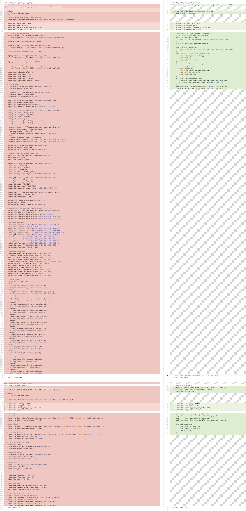
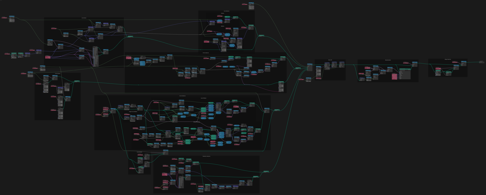

::: {.content-visible unless-format="revealjs"}
## Abstract

I present an elegant new python scripting API for creating, editing and comparing node trees. Visual programming with nodes is excellent for iteration and great for artist-friendly workflows, but creating or tracking node trees with code has remained a verbose and difficult task. To address these problems, I created a new Python package `nodebpy` for authoring, versioning and interacting with node trees. Human-writeable code becomes nicely arranged node trees, and GUI-authored node trees become human-readable `.py` files easier collaboration and review. With shorter & more logical scripts, LLMs are also able to read and write node trees more reliably and with less token usage. I will show the design and thought process behind the creation of this pacakge, and how it is currently being used in different add-ons and how it could benefit others authoring add-ons, building pipelines and trying to version control node trees.

:::

::: {.content-visible unless-format="revealjs"}

This page is the written version of a talk about [`nodebpy`](https://github.com/BradyAJohnston/nodebpy), a Python package for building Blender node trees as code. The slides are embedded below, or available directly at [this link](slides.html).



:::

::: {.content-visible when-format="revealjs"}

## Slides are Available

[bradyajohnston.github.io/nodebpy/talk.html](https://bradyajohnston.github.io/nodebpy/talk.html)



:::

# The Problem

## Nodes are great. Writing them with code isn't

::: {.incremental}
- Creating a 'runtime' node group requires a large amount of `bpy` code
    - very difficult to read & reason over what the node tree will look like
- More and more core assets are becoming node trees
    - A `.blend` file is a binary blob
    - : no diffs, no code review, minimal version control
- The raw `bpy` API technically works…
:::

::: {.notes}
Set up the two existing options: bundled .blend assets (opaque, un-diffable) or raw bpy (verbose, fragile). Both are painful to maintain across Blender versions.
:::

## The raw `bpy` API {.smaller}

What does this node tree do?

```{python}
#| code-line-numbers: "|1-8|10-15|17-19|21-26|"
import bpy

nt = bpy.data.node_groups.new("Scatter", "GeometryNodeTree")
iface = nt.interface
iface.new_socket("Geometry", in_out="INPUT", socket_type="NodeSocketGeometry")
count = iface.new_socket("Count", in_out="INPUT", socket_type="NodeSocketInt")
count.default_value = 100
iface.new_socket("Geometry", in_out="OUTPUT", socket_type="NodeSocketGeometry")

n_in = nt.nodes.new("NodeGroupInput")
n_out = nt.nodes.new("NodeGroupOutput")
dist = nt.nodes.new("GeometryNodeDistributePointsOnFaces")
inst = nt.nodes.new("GeometryNodeInstanceOnPoints")
sphere = nt.nodes.new("GeometryNodeMeshIcoSphere")
real = nt.nodes.new("GeometryNodeRealizeInstances")

for i, node in enumerate([n_in, dist, inst, real, n_out]):
    node.location = (i * 250, 0)
sphere.location = (250, -320)

nt.links.new(n_in.outputs["Geometry"], dist.inputs["Mesh"])
nt.links.new(n_in.outputs["Count"], dist.inputs["Density"])
nt.links.new(dist.outputs["Points"], inst.inputs["Points"])
nt.links.new(sphere.outputs["Mesh"], inst.inputs["Instance"])
nt.links.new(inst.outputs["Instances"], real.inputs["Geometry"])
nt.links.new(real.outputs["Geometry"], n_out.inputs["Geometry"])
```

## The node tree

```{python}
#| echo: false
from nodebpy.builder import TreeBuilder

TreeBuilder(nt)
```

## What's wrong with that?

::: {.incremental}
- Verbose
- Stringly-typed everything:
    - `"GeometryNodeDistributePointsOnFaces"`, `"NodeSocketGeometry"`, `outputs["Geometry"]`
- No autocomplete, minimal type checking, lots of typos = `RuntimeError`
- The code reads in plumbing order, not data-flow order
:::

## The same tree in `nodebpy`

```{python}
#| code-line-numbers: "|1|3-5|8|9|10|11|12|"
from nodebpy import geometry as g # shader as s, compositor as c

with g.tree("Scatter2") as tree:
    geo = tree.inputs.geometry()
    count = tree.inputs.integer("Count", 100)

    (
        geo
        >> g.DistributePointsOnFaces(density=count)
        >> g.InstanceOnPoints(instance=g.IcoSphere())
        >> g.RealizeInstances()
        >> tree.outputs.geometry()
    )
```

::: {.incremental}
- Every node is a class `g.RealizeInstances()`
- `tree.interface` for input and output sockets
- easily link nodes by overriding `>>` operator
:::

::: {.content-visible unless-format="revealjs"}
27 lines of plumbing become a single pipeline that reads in the same order the data flows. Sockets are matched automatically, layout is automatic, and every name here is a typed Python identifier your IDE can autocomplete and your type checker can verify.
:::

## The pitch

> A text-based version of nodes should bring the convenience of writing code with IDE auto-completion, type hinting, with overall compactness and readability, while staying as close as possible to what building a node tree via the GUI feels like.

```bash
pip install nodebpy
```

- Geometry, Shader **and** Compositor trees fully supported
- Typed & tested, on PyPI, made to be used *inside other add-ons*

# Where it came from

## Molecular Nodes

- Add-on for importing molecular data animation inside of Blender


::: {.incremental}
- MN builds and maintains a *lot* of geometry node groups
- Originally: append pre-made groups from a bundled `.blend`
- Un-diffable, un-reviewable, breaks silently across Blender versions
- Like [`databpy`](https://github.com/BradyAJohnston/databpy): started as an internal tool, broken out into its own typed & tested package
:::

::: {.notes}
The origin story matters to this audience: this isn't a toy, it's extracted from a production add-on with the explicit goal that other add-ons can depend on it.
:::

# Core API

## Everything happens in a tree context

Instantiating a node class adds that node to the active tree:

```{python}
#| output-location: column
with g.tree("NewTree") as tree:
    g.SetPosition() >> g.TransformGeometry()

tree
```

- Every node is a class named after the node: 'Random Value' → `g.RandomValue`
- `>>` links the most compatible socket pair — like Node Wrangler's [Alt]{.kbd} + drag

## Sockets: `.i` and `.o` accessors

Constructor arguments *are* the input sockets — or address them explicitly:

```{python}
#| output-location: column
with g.tree() as tree:
    sp = g.SetPosition(
        g.Cube(),
        offset=g.RandomValue() * 0.1,
    )
    _ = (g.Position() * 0.5) >> sp.i.position

tree
```

- `node.i.position` / `node.o.geometry` — typed, autocompleted socket access
- Vector outputs get `.x` / `.y` / `.z`, colors get `.r/.g/.b/.a`, matrices get `.translation/.rotation/.scale`

## The tree interface

`tree.inputs.*` / `tree.outputs.*` declare the group's sockets and return them for linking:

```{python}
#| output-location: column
with g.tree() as tree:
    count = tree.inputs.integer("Count", 10)
    pos = g.RandomValue.vector(min=-1)

    _ = (
        g.Points(count, position=pos)
        >> tree.outputs.geometry()
    )

tree
```

## Python operators become nodes

`+ - * / ** % //`, comparisons and `& | ^ ~` lift to `Math`, `VectorMath`, `IntegerMath`, `Compare` and `BooleanMath` — dispatched on socket type:

```{python}
#| output-location: column
#| code-line-numbers: "|2-4|5|"
with g.tree("Checkerboard") as tree:
    idx = g.Index()
    row = idx // 10
    col = idx % 10
    is_checker = ((row + col) % 2) > 0

    _ = (
        g.Grid(10, 10, 10, 10)
        >> g.SetPosition(
            selection=is_checker,
            offset=(0, 0, 0.5),
        )
        >> tree.outputs.geometry()
    )

tree
```

## Runtime vs build time

Comparing sockets builds a `Compare` node — evaluated *per frame, per element* in the tree. Comparing plain Python values is evaluated *once*, at build time:

```{python}
#| output-location: column
with g.tree() as tree:
    frame = g.SceneTime().o.frame
    comp = frame > 50  # a Compare node

    _ = g.Switch.geometry(
        comp, g.Cube(), g.Cone()
    ) >> tree.outputs.geometry()

tree
```

::: {.notes}
Worth dwelling on for a technical audience — the operator overloading is doing graph construction, not evaluation. Same mental model as any embedded DSL / expression-template library.
:::

## Enum subtypes as class methods

Enum properties (`data_type`, `domain`, `operation`, `mode`) are keyword-only — but common combinations are class methods:

```python
g.RandomValue(data_type="FLOAT_VECTOR")   # works
g.RandomValue.vector()                    # reads better

g.EvaluateOnDomain(domain="EDGE", data_type="FLOAT")
g.EvaluateOnDomain.edge.float()           # domain, then data_type

g.Compare(A=a, B=b, data_type="INT", operation="EQUAL")
g.Compare.integer.equal(a, b)
a == b                                    # or just this
```

All enum values are `Literal[...]`-typed, so both spellings autocomplete and type-check.

## Zones

Repeat / simulation / for-each zones come as a single object with an `item()` helper for the four sockets each item touches:

```{python}
#| output-location: column
with g.tree("Stack") as tree:
    zone = g.RepeatZone(5)
    geo = zone.item("Geometry", g.Cube())

    _ = (
        geo.current
        >> g.TransformGeometry(
            translation=(0, 0, 1.1)
        )
        >> geo.next
    )
    _ = geo.result >> tree.outputs.geometry()

tree
```

- `item.initial` → `item.current` → `item.next` → `item.result`
- `zone.iteration`, `zone.delta_time` for the built-in sockets

## Frames

Organisation survives the round trip to code:

```{python}
#| output-location: column
with g.tree("Wave") as tree:
    height = tree.inputs.float("Height", 3.0)

    with g.Frame("Compute the wave"):
        pos = g.Position().o.position
        z = height * g.Math.sine(pos.x * 2.0)

    with g.Frame("Displace"):
        mesh = (
            g.Grid(20, 20, 200, 200)
            >> g.SetPosition(
                offset=g.CombineXYZ(z=z)
            )
        )
    _ = mesh >> tree.outputs.geometry()

tree
```

# Beyond Geometry Nodes

## Shader trees & materials

Same API, different module — `s.material()` builds a `bpy.types.Material` directly:

```{python}
#| output-location: column
from nodebpy import shader as s

with s.material("BrushedMetal") as mat:
    noise = s.NoiseTexture(scale=8.0).o.fac

    _ = s.PrincipledBSDF(
        base_color=(0.8, 0.55, 0.2, 1.0),
        metallic=1.0,
        roughness=noise * 0.4 + 0.1,
    ) >> s.MaterialOutput()

mat
```

## Compositor trees

```{python}
#| output-location: column
from nodebpy import compositor as c

with c.tree("ToonPost") as tree:
    image = tree.inputs.color("Image")
    depth = tree.inputs.float("Depth")

    painterly = image >> c.Kuwahara(size=6.0)
    outline = depth >> c.Filter.sobel() > 0.05

    _ = (
        c.Mix.color(outline, painterly)
        >> tree.outputs.color("Image")
    )

tree
```

Shared nodes (`Math`, `Mix`, textures…) are defined once and re-exported per editor, so the same expressions work in all three.

# Reusable Groups

## Custom node groups as classes {.smaller}

Subclass `CustomGeometryGroup`: `_name`, an `__init__` for the inputs, `_build_group` for the internal graph.

```{python}
#| output-location: column
from nodebpy.builder import CustomGeometryGroup
from nodebpy.types import InputFloat, InputGeometry, InputInteger

class Jitter(CustomGeometryGroup):
    """Randomly offset each point."""
    _name = "Jitter"

    def __init__(
        self,
        geometry: InputGeometry = ...,
        amount: InputFloat = 0.2,
        seed: InputInteger = 0,
    ):
        super().__init__(
            geometry=geometry, amount=amount, seed=seed
        )

    def _build_group(self, tree):
        geometry = tree.inputs.geometry("Geometry")
        amount = tree.inputs.float("Amount", 0.2)
        seed = tree.inputs.integer("Seed")

        offset = g.RandomValue.vector(min=-1, seed=seed) * amount
        _ = geometry >> g.SetPosition(offset=offset) >> tree.outputs.geometry()


with g.tree("JitterDemo") as tree:
    _ = (
        g.IcoSphere(subdivisions=4)
        >> Jitter(amount=0.15)
        >> tree.outputs.geometry()
    )

tree
```

- Built once, cached in `bpy.data.node_groups`; instances are cheap
- Chains with `>>`, mixes with operators, autocompletes — indistinguishable from a built-in node

## Asset node groups

Blender's bundled "essentials" (and *your* asset libraries) become typed classes too — instantiating one appends the group at runtime:

```{python}
#| output-location: column
with g.tree("Assets") as tree:
    mesh = g.SmoothByAngle(
        mesh=g.Cube(), angle=0.6
    ).o.mesh

    _ = (
        g.Array(geometry=mesh, count=4)
        >> tree.outputs.geometry()
    )

tree
```

Generate the same for your own add-on's `.blend`:

```python
from nodebpy.assets import generate_asset_api, PackageLibrary

generate_asset_api(
    PackageLibrary(__file__, "data/my_assets.blend"),
    "my_addon/nodes/assets.py",
)
```

# Nodes → Code

## `to_python()` — the other direction {.smaller}

Remember the raw `bpy` tree from the start? Any tree — GUI-built, appended, or raw `bpy` — converts back to `nodebpy` source:

```{python}
from nodebpy.export import to_python

code = to_python(nt)
```

```{python}
#| echo: false
#| output: asis
print(f"```python\n{code}\n```")
```

## Comparison



## The generator is smart about it

::: {.incremental}
- `Math` set to `SINE` comes back as `g.Math.sine(...)`; multiply nodes come back as `*`; `SeparateXYZ` dissolves into `.x`
- Zones and frames reconstruct through the zone-item and `with g.Frame(...)` APIs
- `snapshot_positions=True` preserves hand-authored layouts; `top_level="class"` archives whole groups as `CustomGeometryGroup` subclasses
- Round-trip stable: convert → run → convert produces identical source
- Validated against Blender's full bundled essentials libraries — it handles real trees, not just its own
:::

::: {.content-visible unless-format="revealjs"}
This is the migration path: wire a tree up by hand in the GUI where that's fastest, then `to_python()` it into version-controlled, reviewable, diffable source. It also makes snapshot-testing node trees trivial.
:::

# Assets as Code

## Blender's own assets are `.blend` files

The essentials libraries live in `blender/blender-assets`, tracked with Git LFS. Every pull request is the same diff:

```diff
--- a/work/bundled/nodes/geometry_nodes_essentials.blend
+++ b/work/bundled/nodes/geometry_nodes_essentials.blend
@@ -1,3 +1,3 @@
 version https://git-lfs.github.com/spec/v1
-oid sha256:5cff38c3aa43238df1dc79722a98d84a7b6967243fbfa0b4700019230eb05930
-size 892387
+oid sha256:4cec3e3848fc8e673308e2c7053634f520f8c18f5b057ef26e0647ab80d898f8
+size 891869
```

::: {.incremental}
- Reviewers get a description and before / after screenshots
- Nothing says which of the 28 assets changed, or what changed inside them
:::

::: {.notes}
This is PR #94, "Preserve Normals reverted to False for assets". The whole story of that PR is on the next few slides, and none of it is visible here.
:::

## Dump the library, diff the source {.smaller}

```bash
git show 0a12785:work/bundled/nodes/geometry_nodes_essentials.blend | git lfs smudge > before.blend
git show b665a97:work/bundled/nodes/geometry_nodes_essentials.blend | git lfs smudge > after.blend

python -m nodebpy.assets dump before.blend before/
python -m nodebpy.assets dump after.blend  after/
diff -ru before/ after/
```

::: {.incremental}
- 28 assets → 4,335 lines of Python, in 2.4 seconds
- One module per asset; helpers shared between assets go to `_shared/`
- Frames become `with g.Frame(...)`, the interface becomes `tree.inputs.*`, catalog and metadata travel in a module footer
- The dumper's `bpy` must be at least the file's version: 5.2 silently dropped the 5.3-only sockets and two of the PRs below diffed to *nothing*
:::

## Eight real PRs, twice {.smaller}

| PR | Title | `git diff` | dumped diff | files |
|:--|:--|--:|--:|:--|
| #82 | Preserve normals in mirrored modifier assets | 2 / 2 | +10 / −8 | 3 |
| #91 | Add Miter Scale inputs to Curve to Tube | 2 / 2 | +29 / −10 | **4** |
| #94 | Preserve Normals reverted to False for assets | 2 / 2 | +10 / −8 | 3 |
| #85 | Seed input for the guide mask, all hair guide nodes | 2 / 2 | +64 / −36 | 4 |
| #84 | Curve to Tube: don't merge uncapped endpoints | 2 / 2 | +102 / −70 | 1 |
| #66 | Array: handle single curve consistently | 2 / 2 | +59 / −54 | 1 |
| #63 | Array: rotation alignment options | 2 / 2 | +85 / −164 | 1 |
| #78 | Move Capture Rest Geometry to Geometry › Write | 2 / 2 | +1 / −1 | 1 |

::: {.notes}
Dumped with the 5.3 branch of nodebpy on the bpy 5.3 alpha wheel. Row #91 is the one to watch: a PR about one asset that changes four files.
:::

## PR #82: preserve normals when realizing {.smaller}

One keyword on the internal Realize Instances node, in three modifier assets:

```diff
--- before/geometry/array.py
+++ after/geometry/array.py
@@ -825,7 +825,7 @@
         with g.Frame("Merge Instances"):
             realize_instances_1 = g.RealizeInstances(
-                geometry=switch_16, realize_to_point_domain=True
+                geometry=switch_16, preserve_normals=True, realize_to_point_domain=True
             )
--- before/geometry/scatter_on_surface.py
+++ after/geometry/scatter_on_surface.py
@@ -520,10 +520,10 @@
-        switch_20 = realize_instances.switch.geometry(
-            switch_19,
-            g.RealizeInstances(geometry=switch_19, realize_to_point_domain=True),
+        realize_instances_1 = g.RealizeInstances(
+            geometry=switch_19, preserve_normals=True, realize_to_point_domain=True
         )
+        switch_20 = realize_instances.switch.geometry(switch_19, realize_instances_1)
```

`instance_on_elements.py` gets the same change.

## PR #91: add Miter Scale to Curve to Tube {.smaller}

The part the description talks about:

```diff
--- before/geometry/curve_to_tube.py
+++ after/geometry/curve_to_tube.py
@@ -215,6 +215,25 @@
+            with tree.inputs.panel("Miter Scale", default_closed=True, ...):
+                miter_scale = tree.inputs.boolean(
+                    "Miter Scale", True, is_panel_toggle=True, ...
+                )
+                miter_scale_limit = tree.inputs.float(
+                    "Miter Scale Limit", 3 * math.pi / 4,
+                    min_value=0.0, max_value=math.pi, subtype="ANGLE", ...
+                )
@@ -715,6 +734,8 @@
                 profile_curve=capture_8.o.geometry,
                 scale=radius.output,
                 fill_caps=switch_2,
+                miter_scale=miter_scale,
+                miter_scale_limit=miter_scale_limit,
             )
```

## PR #91: …and three files it never mentions {.smaller}

```diff
--- before/geometry/array.py
+++ after/geometry/array.py
@@ -825,7 +825,7 @@
             realize_instances_1 = g.RealizeInstances(
-                geometry=switch_16, preserve_normals=True, realize_to_point_domain=True
+                geometry=switch_16, realize_to_point_domain=True
             )
--- before/geometry/instance_on_elements.py
+++ after/geometry/instance_on_elements.py
-        realize_instances_1 = g.RealizeInstances(
-            geometry=translate_instances,
-            preserve_normals=True,
-            realize_to_point_domain=True,
-        )
--- before/geometry/scatter_on_surface.py
+++ after/geometry/scatter_on_surface.py
-        realize_instances_1 = g.RealizeInstances(
-            geometry=switch_19, preserve_normals=True, realize_to_point_domain=True
```

::: {.incremental}
- The author started from a `.blend` saved before #82 landed
- PR #94, two commits later, is #82's diff applied a second time
:::

## What each workflow would have shown

::: {.incremental}
- **Binary:** the regression was found by rendering the assets and noticing the shading was wrong
- **Dumped source:** a "4 files changed" header on a PR whose title names one asset
- **Source as the tracked artefact:** a merge conflict, not a regression
- Every diff on these slides came from `git show | git lfs smudge | dump | diff`. The missing piece is a CI job that does it per PR
:::

::: {.notes}
Nobody did anything wrong here. The binary workflow gives a reviewer no way to see that a change to one asset carried three unrelated reverts.
:::

## The tree, for scale



`array.py` is 858 lines. PR #82 changed one keyword in it. `python -m nodebpy.assets plot` rendered this headlessly.

## Where the noise comes from {.smaller}

Bigger PRs look bigger than they are: inserting one node renumbers every later auto-named `switch_N`.

| PR | changed lines | ignoring `_N` suffixes |
|:--|--:|--:|
| #84 Curve to Tube caps | 172 | 70 |
| #66 Array single curve | 113 | 25 |
| #63 Array rotation | 244 | 172 |
| #85 Hair seed | 100 | 100 |

::: {.incremental}
- Labelled nodes dump under their label, so a labelled switch keeps its name
- One authoring habit turns #66 into the 25-line diff it actually is
:::

## Reading the trees as text {.smaller}

Ten minutes of `grep` over the dumped sources at HEAD:

::: {.incremental}
- **A dead modifier input.** Displace Hair Curves declares `Surface UV Map`; no node reads it. The dumper marks it `_surface_uv_map`
- **Two typos** that the proofreading PR missed: a tooltip says *displacemement*, an Array frame is labelled *Line Gismoz*
- **The same Domain Size node built twice**, three lines apart, in Array (since #66)
- **Two inputs named "Scale"** on Randomize Transforms, so Array and Scatter on Surface link them positionally
- **Start and end caps tested two different ways** in Curve to Tube's custom-cap merge (#84)
- Frame labels: *segment length* next to *Segment Length*
:::

::: {.notes}
None of these is visible in a screenshot of the node editor unless you are looking at exactly the right node. All of them are one grep away in the source.
:::

## It found a nodebpy bug as well {.smaller}

The generator rounded float defaults to four decimals, so an untouched Curve to Mesh (Miter Scale Limit exactly 3π/4) compared as *edited*:

```diff
-                fill_caps=switch_2,
-                miter_scale_limit=3 * math.pi / 4,
+                fill_caps=switch_2,
```

::: {.incremental}
- 18 spurious keyword arguments across the essentials and hair libraries: `radius=0.1`, `length=0.1`, `radius=0.05`, `distance=0.001`, `miter_scale_limit=…`
- Fixed in 520.29: constructor defaults are now Blender's exact float32 values, or `math.pi` expressions for its rational multiples
- Diffing real libraries is the test suite that finds this
:::

## Molecular Nodes: the workflow in production {.smaller}

344 node modules are the source of truth; `nodes.blend` is a build product. `check` in CI proves build → dump reproduces them exactly.

PR #1239: three bugs found *reading the source*, each with a numeric test that fails on `main`:

```diff
 # simulate_elastic_network.py — inverse mass stored 2·m instead of 1/m
-            geometry_1.current, name="inverse_mass", value=Mass().o.mass / 0.5
+            geometry_1.current, name="inverse_mass", value=1.0 / Mass()

 # XPBD Solve Edges — partner weight sampled at the edge index, not the partner point
-            w2=inverse_mass.o.w.point.at(edge_info.o.edge_index),
+            w2=inverse_mass.o.w.point.at(edge_info.o.point_index),
```

The third was an OKLab matrix built from the XYZ → LMS constants instead of sRGB → LMS: blue clipped, white mapped to `(1.003, 0.027, 0.015)`.

::: {.notes}
Nobody opened a node editor to find these. The constants were wrong in the source, and the numbers were checkable against the reference paper.
:::

## Agents, skills and a policy

::: {.incremental}
- `AGENTS.md` + `skills/mn-nodes`: edit the `.py` → `build` → `dump` → read the diff → numeric test
- A new node (Segment ID, #1224) is one 60-line module, a test and a docs entry
- MN's AI policy allows agent-authored node changes *because* the diff, the tests and `check` make a tree reviewable regardless of who or what wrote it
- The same three tools would work for `blender-assets` today
:::

# How It's Built

## Generated from the live node registry

::: {.incremental}
- Most of `src/nodebpy/nodes/` is auto-generated by introspecting Blender's live node registry — signatures, socket types, enum `Literal`s, docstrings
- Hand-written where it matters: zones, operators, the builder core
- Geometry generates first; shader & compositor re-export the shared nodes
- New Blender version → `make generate` → diff review
:::

## Tested like a real dependency

::: {.incremental}
- Tests run against `pip install bpy` — no Blender on `PATH`, CI-friendly
- pytest on macOS, Windows and Linux for every push
- Snapshot tests for generated code and tree structure
- `ruff` + `ty` type-checking enforced in a pre-commit hook
:::

## Versioned against Blender

Scheme: `BLENDER_VERSION.MINOR.PATCH` — currently **``**

::: {.incremental}
- `520.x.y` targets Blender 5.2 — forward-compatible, not backward
- Vendor multiple versions in your add-on and switch on `bpy.app.version` at import time
- You always know exactly which Blender a release targets
:::

```python
_v = bpy.app.version
if _v >= (5, 3, 0):
    from ._530.src.nodebpy import *
elif _v >= (5, 2, 0):
    from ._520.src.nodebpy import *
```

# Using It in Your Add-on

## `pip install nodebpy` {.smaller}

```{python}
#| output-location: column
from bpy.types import GeometryNodeTree

def default_tree(count: int = 10) -> GeometryNodeTree:
    with g.tree("Default Tree") as tree:
        _ = (
            tree.inputs.integer("Count", count)
            >> g.Points(
                position=g.RandomValue.vector()
            )
            >> g.InstanceOnPoints(
                instance=g.IcoSphere()
            )
            >> tree.outputs.geometry("Result")
        )
    return tree.tree

from nodebpy import TreeBuilder
TreeBuilder(default_tree())
```

- Bundle as a `.whl` per the [extension guidelines](https://docs.blender.org/manual/en/latest/advanced/extensions/addons.html#bundle-dependencies), or vendor it
- Your node setups become reviewable Python instead of binary `.blend` payloads

## How it compares

| | approach | on PyPI |
|:--|:--|:--:|
| [NodeToPython](https://github.com/BrendanParmer/NodeToPython) / [TreeClipper](https://github.com/Algebraic-UG/tree_clipper) | trees → storage (`bpy` calls / JSON) | — |
| [geometry-script](https://github.com/carson-katri/geometry-script) | decorated functions, method chaining | — |
| [geonodes](https://github.com/al1brn/geonodes) | context-based, shared node wrappers | — |
| **nodebpy** | context + one typed class per node | ✓ |

::: {.content-visible unless-format="revealjs"}
Side-by-side reproductions of examples from each project's own documentation are in the [comparisons page](comparisons.qmd) of the docs. The short version: the storage-oriented tools are great at persistence but not authoring; the authoring tools each made different API trade-offs, and `nodebpy` is the only one distributed on PyPI for use as a dependency in other projects.
:::

## One more thing about these slides

::: {.incremental}
- Every node graph you've seen was **rendered live from the code on the slide**
- The `_repr_html_` of a tree exports via [TreeClipper](https://github.com/Algebraic-UG/tree_clipper) and renders with `geonodes-web-render`
- The same repr works in Jupyter notebooks and the Quarto docs — docs that can never drift from the code
:::

## Thanks!

- `@bradyajohnston` everywhere
- docs: [bradyajohnston.github.io/nodebpy](https://bradyajohnston.github.io/nodebpy)
- source: [github.com/BradyAJohnston/nodebpy](https://github.com/BradyAJohnston/nodebpy)


