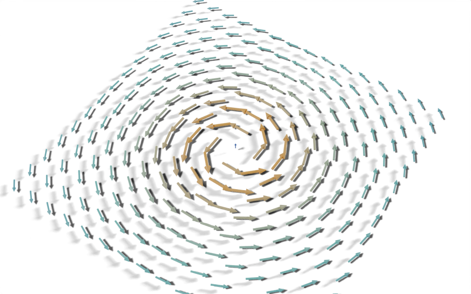

# Arrow Field

geonodes

fields

materials

instancing

Visualise a vector field with arrows, coloured by an attribute read in the material.



A vortex drawn as a grid of arrows, warm where it is strongest.

[Download .blend](images/arrow_field.blend) The scene in this image: the node trees, materials, camera and lights.

A grid of points samples a vortex: a field that swirls around the Z axis and is strongest near it. Each point gets an arrow that points along the field and is scaled by its strength, and the material colours the arrows by the same strength.

``` python
from nodebpy import geometry as g
from nodebpy import shader as s


def arrow(vertices):
    """A unit-length arrow pointing up Z, built from a shaft and a head."""
    shaft = g.Cylinder(vertices, radius=0.05, depth=0.7)
    head = g.Cone(vertices, radius_bottom=0.12, depth=0.3)
    return g.JoinGeometry(
        [
            shaft >> g.TransformGeometry(translation=(0, 0, 0.35)),
            head >> g.TransformGeometry(translation=(0, 0, 0.7)),
        ]
    )


with s.material("Arrow") as material:
    strength = s.Attribute.instancer("strength").o.fac
    ramp = s.ColorRamp(
        strength,
        items=[
            (0.0, (0.05, 0.15, 0.6, 1.0)),
            (0.5, (0.1, 0.7, 0.6, 1.0)),
            (1.0, (1.0, 0.5, 0.05, 1.0)),
        ],
    )
    s.PrincipledBSDF(base_color=ramp, roughness=0.4) >> s.MaterialOutput()


with g.tree("Arrow Field", is_modifier=True) as tree:
    size = tree.inputs.float("Size", 6.0, min_value=0.0)
    count = tree.inputs.integer("Count", 15, min_value=2)
    scale = tree.inputs.float("Arrow Scale", 0.5, min_value=0.0)
    vertices = tree.inputs.integer("Arrow Vertices", 12, min_value=3)

    with g.Frame("Vortex"):
        # swirl around Z, strongest near the axis
        position = g.Position().o.position
        field = position.cross((0, 0, -1)) / (position.length() ** 2 + 0.5)
        strength = field.length() / field.length().point.max()

    points = (
        g.Grid(size, size, count, count)
        >> g.MeshToPoints()
        >> g.StoreNamedAttribute.point.float(name="strength", value=strength)
    )

    (
        points
        >> g.InstanceOnPoints(
            instance=arrow(vertices),
            rotation=g.AlignRotationToVector(vector=field),
            scale=strength.map_range(0.0, 1.0, 0.3, 1.0) * scale,
        )
        >> g.SetMaterial(material=material.material)
        >> tree.outputs.geometry("Geometry")
    )
```

## How it works

- **The arrow** comes from `arrow()`, a Python function that joins a cylinder and a cone into a unit arrow pointing up Z. Calling a function like this adds its nodes to whichever tree is open at the time.
- **The field** is written as ordinary vector arithmetic. `position.cross((0, 0, -1))` is a vector at right angles to the position, which makes the swirl, and dividing by `position.length() ** 2 + 0.5` makes it fall off away from the centre. Each operator adds a Vector Math or Math node.
- **Strength** is the field’s length divided by its largest value over all points, `field.length().point.max()`. The `.point` domain methods (`.max()`, `.mean()`, `.total()` and others) add the matching statistic node evaluated on the point domain.
- **Instancing.** Align Rotation to Vector turns each arrow’s Z axis along the field, and the strength, remapped to between 0.3 and 1, sets its scale.
- **Colour.** The strength is stored as a point attribute before instancing, which carries it onto each instance. The material reads it with `s.Attribute.instancer("strength")`, the instancer type being the one that reads attributes stored on instances, and maps it through a three-stop Color Ramp. The ramp’s stops are a list of `(position, colour)` pairs.

## Node trees

## Original

Based on the arrow field in [`demos/arrows.py`](https://github.com/al1brn/geonodes/blob/main/demos/arrows.py) in geonodes ([write-up](https://github.com/al1brn/geonodes/blob/main/docs/demos/arrows.md)), which also offers several head shapes through closures and a menu, and builds arrows from cartesian, polar or spherical coordinates.
