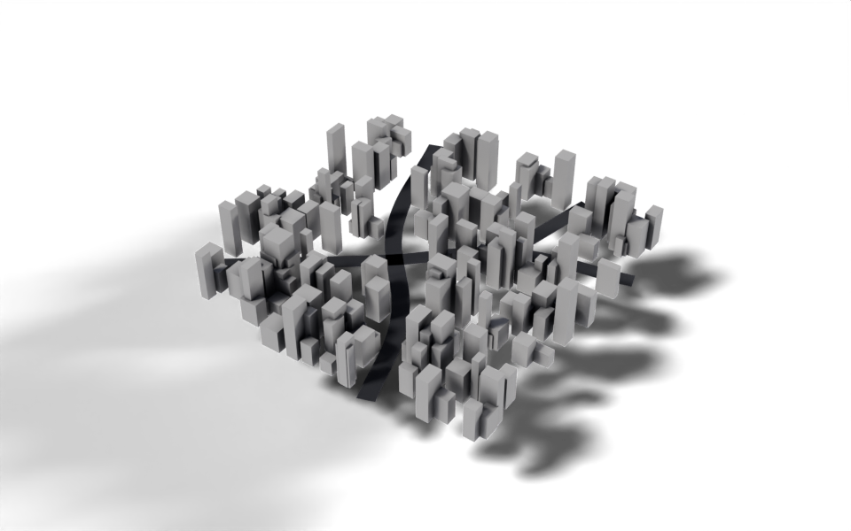

# City Builder

Geometry Script

curves

proximity

Draw roads with a curve and fill the space between them with buildings.



Three Bézier roads through a block of randomly sized buildings.

[Download .blend](images/city_builder.blend) The scene in this image: the node trees, materials, camera and lights.

The modifier goes on a curve object: each spline is a road. Building lots are scattered over a grid, any lot too close to a road is removed, and a box of random size is placed on each lot that is left. Drawing a new road in Edit Mode clears a path through the city straight away.

``` python
from nodebpy import geometry as g
from nodebpy import shader as s

with s.material("Asphalt") as asphalt:
    (
        s.PrincipledBSDF(base_color=(0.02, 0.02, 0.025, 1.0), roughness=0.8)
        >> s.MaterialOutput()
    )

with g.tree("City Builder", is_modifier=True) as tree:
    roads = tree.inputs.geometry("Roads")
    road_width = tree.inputs.float("Road Width", 0.25, min_value=0.0)
    with tree.inputs.panel("City"):
        size_x = tree.inputs.float("Size X", 5.0, min_value=0.0)
        size_y = tree.inputs.float("Size Y", 5.0, min_value=0.0)
        density = tree.inputs.float("Density", 10.0, min_value=0.0)
        seed = tree.inputs.integer("Seed")
    with tree.inputs.panel("Buildings"):
        smallest = tree.inputs.vector("Size Min", (0.1, 0.1, 0.2))
        largest = tree.inputs.vector("Size Max", (0.3, 0.3, 1.0))
        material = tree.inputs.material("Material")

    with g.Frame("Roads"):
        half = road_width / 2
        profile = g.CurveLine(start=g.CombineXYZ(x=-half), end=g.CombineXYZ(x=half))
        road_mesh = (
            roads
            >> g.CurveToMesh(profile_curve=profile)
            >> g.SetMaterial(material=asphalt.material)
        )

    with g.Frame("Building Lots"):
        # scatter lots everywhere, then clear the ones that land on a road
        road_points = g.CurveToPoints.evaluated(roads)
        distance = g.GeometryProximity(road_points, target_element="POINTS").o.distance
        lots = (
            g.Grid(size_x, size_y)
            >> g.DistributePointsOnFaces(density=density, seed=seed)
            >> g.DeleteGeometry.point(selection=distance < road_width)
        )

    with g.Frame("Buildings"):
        # move the cube up so it sits on the ground before it is scaled
        block = (
            g.Cube()
            >> g.TransformGeometry(translation=(0, 0, 0.5))
            >> g.SetMaterial(material=material)
        )
        size = g.RandomValue.vector(min=smallest, max=largest, seed=seed)
        buildings = lots >> g.InstanceOnPoints(instance=block, scale=size)

    g.JoinGeometry([road_mesh, buildings]) >> tree.outputs.geometry("City")
```

## How it works

- **Roads.** Curve to Mesh sweeps a straight profile, as wide as `Road Width`, along every spline. The profile’s ends are built from the input with `g.CombineXYZ(x=...)`, and `road_width / 2` is a Math node made by the `/` operator.
- **Lots.** Distribute Points on Faces scatters points on a grid. Geometry Proximity measures how far each point is from the nearest point on the evaluated road curves, and `distance < road_width` creates a Compare node whose result selects the points to delete.
- **Buildings.** The cube is moved up by half its height first, so when it is scaled on a lot it grows upwards from the ground rather than in both directions. Random Value in vector mode gives each building its own footprint and height between `Size Min` and `Size Max`.
- **Materials.** The roads get an asphalt material created in the same script with `s.material`. The buildings take theirs from the `Material` input.

`with tree.inputs.panel("City"):` groups inputs into a collapsible panel in the modifier, and `with g.Frame("Roads"):` puts every node created in the block into a frame, so the tree’s layout follows the script’s structure.

## Node tree

## Original

Ported from the [City Builder tutorial](https://carson-katri.github.io/geometry-script/tutorials/city-builder.html) and [`City Builder.py`](https://github.com/carson-katri/geometry-script/blob/main/examples/City%20Builder.py) in Geometry Script. The original `yield`s the roads and buildings so they are joined automatically; here the two results are named variables passed to an explicit Join Geometry.
