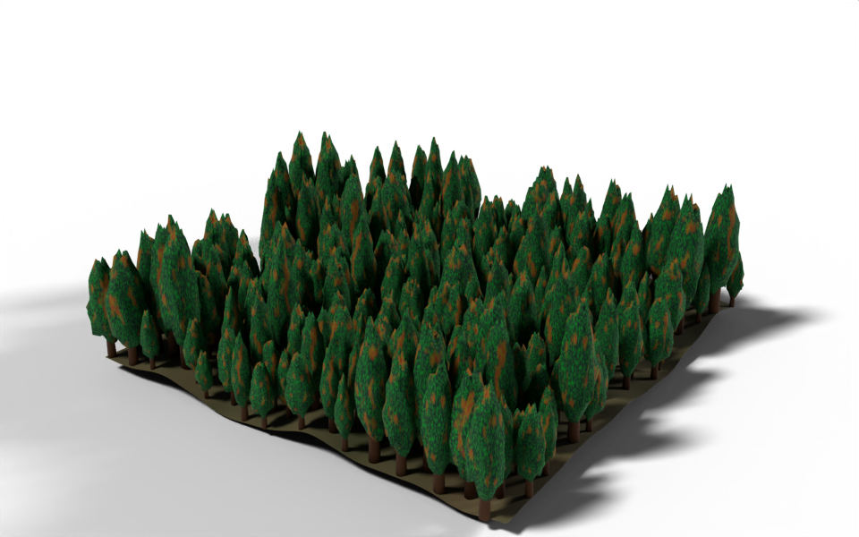

# Forest

geonodes

custom groups

materials

instancing

A tree node group, a handful of variants built in a Python loop, and a forest planted on noisy hills.



A few hundred conifers on rolling terrain.

There are three layers to this one. A **Tree** group builds a single conifer from a few proportions and a seed. The modifier builds five variants of it, then plants them over a noise-displaced terrain, picking one of the variants for each spot.

``` python
from math import tau

from nodebpy import geometry as g
from nodebpy import shader as s
from nodebpy.builder import CustomGeometryGroup
from nodebpy.types import InputFloat, InputInteger


def mottled(scale, a, b, middle=0.5, spread=0.2):
    """Patches of ``b`` over ``a``, through a noise texture of the given scale.

    The noise is normalized to around 0.5, so a higher ``middle`` gives fewer,
    smaller patches of ``b``.
    """
    noise = s.NoiseTexture(scale=scale).o.fac
    return noise.map_range(middle - spread, middle + spread).mix.color(a, b)


with s.material("Bark") as bark:
    (
        s.PrincipledBSDF(base_color=(0.097, 0.036, 0.008, 1.0), roughness=0.9)
        >> s.MaterialOutput()
    )

with s.material("Foliage") as foliage:
    dark, light = (0.002, 0.035, 0.015, 1.0), (0.001, 0.427, 0.015, 1.0)
    greens = mottled(37.0, dark, light, middle=0.65)
    browns = mottled(20.0, (0.209, 0.168, 0.004, 1.0), (0.264, 0.033, 0.013, 1.0))
    color = mottled(5.0, greens, browns, middle=0.6, spread=0.05)
    s.PrincipledBSDF(base_color=color, roughness=0.9) >> s.MaterialOutput()

with s.material("Ground") as ground:
    color = mottled(2.0, (0.05, 0.06, 0.02, 1.0), (0.12, 0.09, 0.04, 1.0))
    s.PrincipledBSDF(base_color=color, roughness=1.0) >> s.MaterialOutput()


class Tree(CustomGeometryGroup):
    """A conifer: a tapered trunk inside a squashed, randomly lumpy sphere."""

    _name = "A Tree"
    _color_tag = "GEOMETRY"

    def __init__(
        self,
        height: InputFloat = 7.0,
        width: InputFloat = 0.5,
        trunk: InputFloat = 0.2,
        conic: InputFloat = 0.4,
        seed: InputInteger = 0,
    ):
        super().__init__(
            height=height, width=width, trunk=trunk, conic=conic, seed=seed
        )

    def _build_group(self, tree):
        height = tree.inputs.float("Height", 7.0, min_value=0.0, subtype="DISTANCE")
        width = tree.inputs.float("Width", 0.5, min_value=0.0, subtype="FACTOR")
        trunk = tree.inputs.float(
            "Trunk", 0.2, min_value=0.0, max_value=0.9, subtype="FACTOR"
        )
        conic = tree.inputs.float(
            "Conic", 0.4, min_value=-1.0, max_value=1.0, subtype="FACTOR"
        )
        seed = tree.inputs.integer("Seed")

        with g.Frame("Trunk"):
            base = height * 0.04
            stem = g.Cone(
                radius_bottom=base, radius_top=base / 3, depth=height * 0.9
            ) >> g.SetMaterial(material=bark.material)

        with g.Frame("Foliage"):
            # stretch a unit sphere into the crown, wider at the bottom when conic
            crown = height * (1 - trunk)
            radius = width * height
            position = g.Position().o.position
            spread = position.z.map_range(
                -0.5, 0.5, radius * (1 + conic), radius * (1 - conic)
            )
            shape = g.CombineXYZ(spread, spread, crown) * g.RandomValue.vector(
                0.8, 1.2, seed=seed
            )
            leaves = (
                g.IcoSphere(radius=0.5, subdivisions=3)
                >> g.SetPosition(
                    position=position * shape + g.CombineXYZ(z=height - crown / 2)
                )
                >> g.SetMaterial(material=foliage.material)
            )

        (
            g.JoinGeometry([stem, leaves])
            >> g.SetShadeSmooth()
            >> tree.outputs.geometry("Tree")
        )


# height and width of each tree variant
SHAPES = [(6, 0.3), (7, 0.25), (8, 0.3), (9, 0.2), (10, 0.22)]

with g.tree("Forest", is_modifier=True) as tree:
    size = tree.inputs.float("Size", 40.0, min_value=0.0, subtype="DISTANCE")
    spacing = tree.inputs.float("Spacing", 2.0, min_value=0.1, subtype="DISTANCE")
    hills = tree.inputs.float("Hills", 8.0, subtype="DISTANCE")
    seed = tree.inputs.integer("Seed")

    with g.Frame("Terrain"):
        bumps = g.NoiseTexture(scale=0.05).o.fac - 0.5
        terrain = (
            g.Grid(size, size, 80, 80)
            >> g.SetPosition(offset=g.CombineXYZ(z=bumps * hills))
            >> g.SetShadeSmooth()
            >> g.SetMaterial(material=ground.material)
        )

    with g.Frame("Tree Variants"):
        # a handful of trees, each with its own seed and proportions
        variants = g.GeometryToInstance(
            *[Tree(height, width, seed=i) for i, (height, width) in enumerate(SHAPES)]
        )

    with g.Frame("Planting"):
        trees = (
            terrain
            >> g.DistributePointsOnFaces(
                distance_min=spacing,
                density_max=1.0,
                seed=seed,
                distribute_method="POISSON",
            )
            >> g.InstanceOnPoints(
                instance=variants,
                pick_instance=True,
                instance_index=g.RandomValue.integer(0, len(SHAPES) - 1, seed=seed + 1),
                rotation=g.CombineXYZ(z=g.RandomValue.float(0, tau, seed=seed + 2)),
                scale=g.RandomValue.float(0.6, 1.3, seed=seed + 3),
            )
        )

    g.JoinGeometry([terrain, trees]) >> tree.outputs.geometry("Geometry")
```

## How it works

**Materials.** `mottled()` is a plain Python function that returns a socket: a noise texture remapped to a factor and used to mix two colours. Calling it three times, once with the results of the other two, gives the foliage its green and brown patches without repeating the same four nodes by hand. Helper functions like this are the simplest way to factor out a sub-graph that is only used inside one tree.

**The tree.** The trunk is a cone. The crown is a unit icosphere stretched into shape in one Set Position:

- `position.z.map_range(...)` gives a width that shrinks from the bottom of the sphere to the top, and `Conic` sets how much;
- multiplying by `g.RandomValue.vector(0.8, 1.2, seed=seed)` makes each seed a little lumpier in a different way;
- adding `g.CombineXYZ(z=height - crown / 2)` lifts the crown to the top of the trunk.

Every expression in that `position=` argument is evaluated on the icosphere’s own points, which is why `position` can be used on both sides.

**Variants.** `Tree(height, width, seed=i)` adds a group node, so the list comprehension adds five of them, one per entry in `SHAPES`, and `g.GeometryToInstance(*variants)` gathers them into one instances geometry. The loop runs in Python while the tree is built: the result is five group nodes in the tree, not a loop in Blender. With `pick_instance=True`, Instance on Points uses `instance_index` to pick one of the five for each point, and the index range comes from `len(SHAPES)`, so adding a variant to the list is the only change needed.

**Planting.** Poisson-disc distribution keeps the trees at least `Spacing` apart. Each tree gets a random turn about Z and a random scale, each with its own seed offset so the three random values are independent.

## Node trees

The modifier:

Inside the **A Tree** group:

## Original

Ported from [`demos/forest.py`](https://github.com/al1brn/geonodes/blob/main/demos/forest.py) in geonodes. The original builds the variants with a For Each Element zone over the points of a mesh line, so the number of variants can be a modifier input. Here the count is fixed when the script runs, which is all a Python loop can do, and in exchange each variant can be given its own proportions directly.
