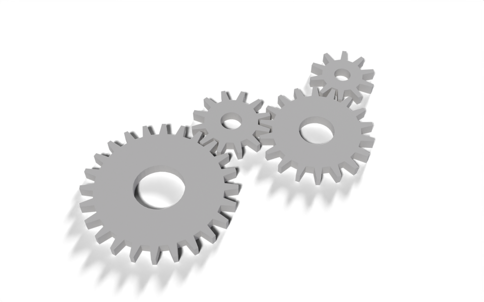

# Gear Train

geonodes

custom groups

curves

A gear group driven by tooth count and module, and a train of gears that mesh and turn together.



Four gears of different sizes, meshing in a chain.

[Download .blend](images/gears.blend) The scene in this image: the node trees, materials, camera and lights.

A **Gear** group draws one spur gear from its tooth count and *module*, the size of a tooth. Gears with the same module always mesh, so the modifier can place a chain of them from nothing more than a list of tooth counts and directions, and turn the whole chain with a single `Spin` input.

``` python
from math import cos, pi, sin, tau

from nodebpy import geometry as g
from nodebpy.builder import CustomGeometryGroup
from nodebpy.types import InputFloat, InputInteger


class Gear(CustomGeometryGroup):
    """A spur gear with trapezoidal teeth, sized by its tooth count and module."""

    _name = "Gear"
    _color_tag = "GEOMETRY"

    def __init__(
        self,
        teeth: InputInteger = 16,
        module: InputFloat = 0.1,
        thickness: InputFloat = 0.2,
        rotation: InputFloat = 0.0,
    ):
        super().__init__(
            teeth=teeth, module=module, thickness=thickness, rotation=rotation
        )

    def _build_group(self, tree):
        teeth = tree.inputs.integer("Teeth", 16, min_value=4)
        module = tree.inputs.float("Module", 0.1, min_value=0.0)
        thickness = tree.inputs.float("Thickness", 0.2, min_value=0.0)
        rotation = tree.inputs.float("Rotation", 0.0, subtype="ANGLE")

        with g.Frame("Tooth Profile"):
            # every tooth is four points: up the leading flank, across the tip,
            # down the trailing flank; the root carries on to the next tooth
            pitch = module * teeth / 2
            tip, root = pitch + module, pitch - 1.25 * module

            index = g.Index()
            corner = index % 4
            fraction = g.IndexSwitch.float(corner, [0.0, 0.15, 0.35, 0.5])
            radius = g.IndexSwitch.float(corner, [root, tip, tip, root])
            angle = (index // 4 + fraction) * tau / teeth + rotation

            position = g.CombineXYZ(radius * angle.cos(), radius * angle.sin())
            outline = g.CurveCircle(resolution=teeth * 4) >> g.SetPosition(
                position=position
            )

        with g.Frame("Solid"):
            bore = g.CurveCircle(radius=root * 0.4)
            (
                g.JoinGeometry([outline, bore])
                >> g.FillCurve()
                >> g.ExtrudeMesh(offset=g.CombineXYZ(z=thickness), individual=False)
                >> tree.outputs.geometry("Gear")
            )


# each gear in the train: its tooth count and the direction it sits in,
# seen from the gear before it. Neighbours turn in opposite directions, so
# gears two apart turn the same way and must not touch, or the train locks.
TRAIN = [(24, 0.0), (12, 0.6), (18, -0.4), (10, 0.9)]

with g.tree("Gear Train", is_modifier=True) as tree:
    module = tree.inputs.float("Module", 0.1, min_value=0.0)
    thickness = tree.inputs.float("Thickness", 0.2, min_value=0.0)
    spin = tree.inputs.float("Spin", 0.0, subtype="ANGLE")
    material = tree.inputs.material("Material")

    gears = []
    x = y = phase = 0.0  # centre (in modules) and rotation at zero spin
    ratio = 1.0  # how fast this gear turns relative to the first
    previous = None
    for teeth, direction in TRAIN:
        if previous:
            x += (previous + teeth) / 2 * cos(direction)
            y += (previous + teeth) / 2 * sin(direction)
            # put a gap of this gear where a tooth of the previous one points
            phase = direction + pi + previous / teeth * (direction - phase)
            ratio *= -previous / teeth
        previous = teeth

        gear = Gear(teeth, module, thickness, rotation=phase + spin * ratio)
        gears.append(gear >> g.TransformGeometry(translation=module * (x, y, 0.0)))

    (
        g.JoinGeometry(gears)
        >> g.SetMaterial(material=material)
        >> tree.outputs.geometry("Geometry")
    )
```

## How it works

**One gear.** The outline starts as a circle with four points per tooth. For point `index`, `index // 4` is the tooth and `index % 4` is the corner within it: the two root corners and the two tip corners.

- Two Index Switch nodes look up the corner’s angle within the tooth and its radius. The items are passed as Python lists, and an item can be a number or a socket: `root` and `tip` are computed from the inputs.
- The angle and radius become a position with `angle.cos()` and `angle.sin()`, socket methods that add Math nodes.
- A smaller circle for the bore is joined to the outline, and Fill Curve’s even-odd rule turns the pair into a ring. Extrude Mesh gives it thickness.

**The train.** The loop over `TRAIN` runs in Python. It works out each gear’s centre from the previous gear’s, and the starting angle that puts a gap of the new gear where a tooth of the previous one points. Neighbouring gears turn in opposite directions, so gears two apart turn the same way; the directions in `TRAIN` zig-zag to keep those apart, since if they touched the train would lock. The positions and angles are plain floats; the only socket is `spin`, which each gear multiplies by its speed ratio, `-previous / teeth` times the previous gear’s ratio. The sign flips at every mesh.

Mixing Python arithmetic and sockets is the useful idea here: anything known while the script runs stays a Python number, and only values that can change from the modifier panel become nodes. The tree has four Gear nodes and a few Math nodes, not a node for every intermediate number.

## Node trees

The modifier:

Inside the **Gear** group:

## Original

Based on the gear modifiers in [`demos/gears.py`](https://github.com/al1brn/geonodes/blob/main/demos/gears.py) in geonodes, which also round and bevel the teeth and can chain gears across separate objects by reading each other’s parameters from a bundle. This version keeps to straight-sided teeth and builds the chain in one tree.
