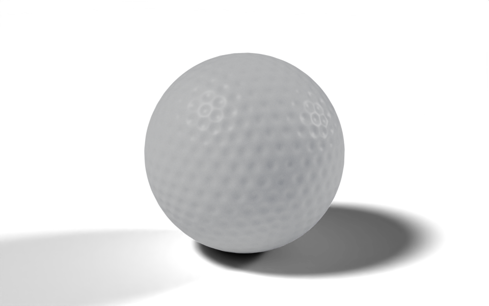

# Golf Ball

geonodes

materials

fields

Dimple a sphere with a proximity field and shade it with a procedural material.



A dimpled golf ball with a speckled, slightly rough surface.

[Download .blend](images/golf_ball.blend) The scene in this image: the node trees, materials, camera and lights.

A coarse icosphere supplies one point per dimple. A dense icosphere is pushed inwards wherever it is close to one of those points, and the depth of the push follows a smooth profile from the centre of the dimple to its rim. The script builds the material as well as the geometry.

``` python
from nodebpy import geometry as g
from nodebpy import shader as s

with s.material("Golf Ball") as material:
    coords = s.TextureCoordinate().o.object
    grain = s.NoiseTexture(coords, scale=180.0, detail=3.0, roughness=0.65).o.fac
    micro = s.NoiseTexture(coords, scale=650.0, detail=2.0).o.fac

    white = grain.map_range(0.25, 0.75, interpolation_type="SMOOTHSTEP")
    color = white.mix.color((0.69, 0.70, 0.67, 1.0), (0.91, 0.91, 0.87, 1.0))

    # darken the inside of each dimple so the pattern reads at a distance
    occlusion = s.AmbientOcclusion(distance=0.05).o.ao
    color = (occlusion**2).mix.color((0.3, 0.3, 0.29, 1.0), color)

    (
        s.PrincipledBSDF(
            base_color=color,
            roughness=grain.map_range(0.2, 0.8, 0.32, 0.46),
            normal=s.Bump(
                height=grain * 0.7 + micro * 0.3, strength=0.16, distance=0.0025
            ),
        )
        >> s.MaterialOutput()
    )


with g.tree("Golf Ball", is_modifier=True) as tree:
    radius = tree.inputs.float("Radius", 1.0, min_value=0.0, subtype="DISTANCE")
    with tree.inputs.panel("Dimples"):
        layout = tree.inputs.integer("Layout", 4, min_value=1, max_value=6)
        width = tree.inputs.float("Width", 0.075, min_value=0.0, subtype="DISTANCE")
        depth = tree.inputs.float("Depth", 0.012, min_value=0.0, subtype="DISTANCE")

    # one dimple centred on each vertex of a coarse icosphere
    centers = g.IcoSphere(radius, subdivisions=layout) >> g.MeshToPoints()
    distance = g.GeometryProximity(centers, target_element="POINTS").o.distance
    profile = distance.map_range(
        0.0, width, 1.0, 0.0, interpolation_type="SMOOTHERSTEP"
    )

    # push the dense surface inwards along its normal
    inwards = g.Position().o.position.normalize() * -(profile * depth)

    (
        g.IcoSphere(radius, subdivisions=7)
        >> g.SetPosition(offset=inwards)
        >> g.SetShadeSmooth()
        >> g.SetMaterial(material=material.material)
        >> tree.outputs.geometry("Geometry")
    )
```

## How it works

**Geometry.**

- Geometry Proximity returns, for every vertex of the dense sphere, the distance to the nearest dimple centre.
- `distance.map_range(0.0, width, 1.0, 0.0, interpolation_type="SMOOTHERSTEP")` turns that distance into a profile that is 1 at the centre and falls smoothly to 0 at the rim. Socket methods such as `map_range` add the matching node and return its result.
- The surface is pushed in along the direction from the centre, `g.Position().o.position.normalize()`, scaled by the profile and the `Depth` input. On a sphere centred at the origin that direction is the normal.
- `Layout` is the subdivision level of the coarse sphere. Blender counts the plain icosahedron as level 1, so level 4 gives 642 dimples, close to a real ball’s 300 to 500.

**Material.** `s.material("Golf Ball")` builds a material the same way `g.tree` builds a node tree. Two noise textures at different scales make the grain of the cover: they drive the colour, the roughness and a Bump node. An Ambient Occlusion node darkens the inside of each dimple, so the pattern still reads when the ball is small on screen. `grain.map_range(...).mix.color(a, b)` uses the remapped value as the factor of a Mix node in colour mode, which reads in the same order as the data flows. In the geometry tree, `material.material` is the `bpy.types.Material`, passed straight to Set Material.

## Node trees

## Original

Ported from the golf ball in [`demos/balls.py`](https://github.com/al1brn/geonodes/blob/main/demos/balls.py) in geonodes, which builds the same material and the same proximity-driven displacement.
