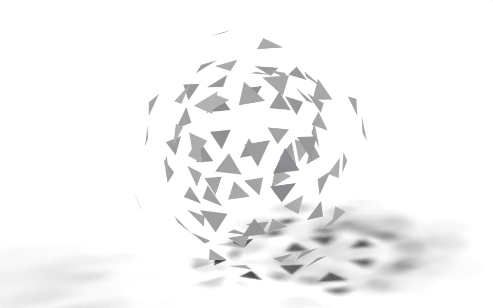

# Examples

Complete node trees written with `nodebpy`, each with a render of the result.

Most of these are ports of examples from two earlier projects that also write Geometry Nodes as Python: [Geometry Script](https://github.com/carson-katri/geometry-script) by Carson Katri and [geonodes](https://github.com/al1brn/geonodes) by Alain Bernard. They are rewritten as `nodebpy` code rather than translated line for line, so each one also shows how the same idea reads in `nodebpy`, and each page links back to the original.

Every example is a single script you can run in Blender’s text editor or headless with the `bpy` module. The script builds the tree and any materials it needs; add the tree to an object as a Geometry Nodes modifier to see the result. The images are rendered by [`docs/examples/render.py`](https://github.com/BradyAJohnston/nodebpy/blob/main/docs/examples/render.py) as part of the documentation build.

##### Voxelize

Rebuild any mesh out of cubes by sampling a volume on a regular grid.

##### Mesh to LEGO

A reusable brick group with studs and holes, used to rebuild a mesh out of bricks.

##### City Builder

Draw roads with a curve and fill the space between them with buildings.

##### Repeat Grid

Lay out copies of any geometry in rows and columns, spaced by its own bounding box.

##### Golf Ball

Dimple a sphere with a proximity field and shade it with a procedural material.

##### Forest

A tree node group, a handful of variants built in a Python loop, and a forest planted on noisy hills.

##### Gear Train

A gear group driven by tooth count and module, and a train of gears that mesh and turn together.

##### Explosion

Break a mesh into its faces and throw them outwards under gravity with a simulation zone.

##### Arrow Field

Visualise a vector field with arrows, coloured by an attribute read in the material.
