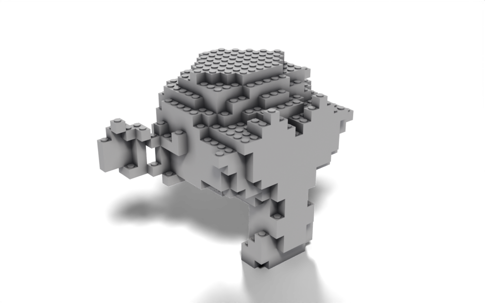

# Mesh to LEGO

Geometry Script

custom groups

mesh boolean

A reusable brick group with studs and holes, used to rebuild a mesh out of bricks.



Suzanne built from 1 × 1 bricks.

[Download .blend](images/lego.blend) The scene in this image: the node trees, materials, camera and lights.

This builds on [Voxelize](../examples/voxelize.llms.md): instead of a plain cube, every grid point gets a brick with a stud on top and a matching hole underneath. The brick is its own node group, written as a `CustomGeometryGroup` class, so it shows up in the tree as a single **LEGO Brick** node and can be reused in any other tree.

``` python
from nodebpy import geometry as g
from nodebpy.builder import CustomGeometryGroup
from nodebpy.types import InputFloat, InputInteger


class LegoBrick(CustomGeometryGroup):
    """A brick of studded cells, with a matching hole underneath each stud."""

    _name = "LEGO Brick"
    _color_tag = "GEOMETRY"

    def __init__(
        self,
        size: InputFloat = 1.0,
        count_x: InputInteger = 1,
        count_y: InputInteger = 1,
    ):
        super().__init__(**{"Size": size, "Count X": count_x, "Count Y": count_y})

    def _build_group(self, tree):
        size = tree.inputs.float("Size", 1.0, min_value=0.0)
        count_x = tree.inputs.integer("Count X", 1, min_value=1)
        count_y = tree.inputs.integer("Count Y", 1, min_value=1)

        with g.Frame("Cell"):
            depth = size / 8
            stud = g.Cylinder(vertices=16, radius=size / 3, depth=depth)
            # the same stud sits on top of the cube and is cut out of its base
            top = stud >> g.TransformGeometry(
                translation=g.CombineXYZ(z=(size + depth) / 2)
            )
            hole = stud >> g.TransformGeometry(
                translation=g.CombineXYZ(z=(depth - size) / 2)
            )
            cell = g.MeshBoolean.difference(
                g.MeshBoolean.union([g.Cube(size=size), top]), [hole]
            )

        with g.Frame("Rows and Columns"):
            row = g.MeshLine(count_x, offset=g.CombineXYZ(x=size))
            row = row >> g.InstanceOnPoints(instance=cell)
            (
                g.MeshLine(count_y, offset=g.CombineXYZ(y=size))
                >> g.InstanceOnPoints(instance=row)
                >> g.RealizeInstances()
                >> g.MergeByDistance()
                >> tree.outputs.geometry("Brick")
            )


with g.tree("Mesh to LEGO", is_modifier=True) as tree:
    geometry = tree.inputs.geometry("Geometry")
    size = tree.inputs.float("Brick Size", 0.2, min_value=0.01, subtype="DISTANCE")
    material = tree.inputs.material("Material")

    (
        geometry
        >> g.MeshToVolume(interior_band_width=size)
        >> g.DistributePointsInVolume(mode="Grid", spacing=size)
        >> g.InstanceOnPoints(instance=LegoBrick(size))
        >> g.RealizeInstances()
        >> g.MergeByDistance()
        >> g.SetMaterial(material=material)
        >> tree.outputs.geometry("Geometry")
    )
```

## How it works

**The brick group.** A `CustomGeometryGroup` subclass names the group with `_name`, exposes its inputs through `__init__` and builds the inside in `_build_group`. The group’s tree is built the first time the class is used, then cached, so the many brick instances all point at one group.

- One cylinder is the stud. It is moved up to sit on the cube’s top face and, separately, moved down to cut a hole of the same shape into the base. Using `stud` on the left of two different `>>` chains links its output to both transforms.
- `g.MeshBoolean.union` and `g.MeshBoolean.difference` are class methods that create a Mesh Boolean node with the operation already set. Their second argument is a list because `Mesh 2` is a multi-input socket.
- `Count X` and `Count Y` lay out several cells as a larger brick by instancing a cell along a line, then that row along a second line. Merge by Distance welds the shared faces into one mesh.

**The modifier.** `LegoBrick(size)` inside the `with g.tree(...)` block adds a group node to the tree, and `>>` connects its `Brick` output to the instance input like any built-in node. The bricks are realized and merged so the result is one mesh, then the `Material` input is applied with Set Material.

## Node trees

The modifier:

Inside the **LEGO Brick** group:

## Original

Ported from [`Mesh to LEGO.py`](https://github.com/carson-katri/geometry-script/blob/main/examples/Mesh%20to%20LEGO.py) in Geometry Script, where the brick is a second `@tree` function called from the first.
