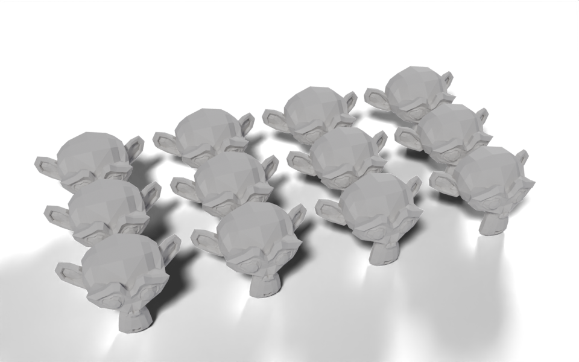

# Repeat Grid

Geometry Script

instancing

Lay out copies of any geometry in rows and columns, spaced by its own bounding box.



Twelve Suzannes, spaced by their own size.

The size of each cell comes from the input geometry itself, so swapping the object for a bigger or smaller one keeps the copies from overlapping without touching the settings.

``` python
from nodebpy import geometry as g

with g.tree("Repeat Grid", is_modifier=True) as tree:
    geometry = tree.inputs.geometry("Geometry")
    columns = tree.inputs.integer("Columns", 4, min_value=1)
    rows = tree.inputs.integer("Rows", 3, min_value=1)
    gap = tree.inputs.vector("Gap", (0.2, 0.2, 0.0), subtype="TRANSLATION")

    # one cell is the geometry's footprint plus the gap between copies
    bounds = g.BoundingBox(geometry)
    cell = bounds.o.max - bounds.o.min + gap

    grid = g.Grid(
        size_x=(columns - 1) * cell.x,
        size_y=(rows - 1) * cell.y,
        vertices_x=columns,
        vertices_y=rows,
    )

    (
        grid
        >> g.MeshToPoints()
        >> g.InstanceOnPoints(instance=geometry)
        >> tree.outputs.geometry("Geometry")
    )
```

## How it works

- Bounding Box gives the corners of the geometry. `bounds.o.max - bounds.o.min` is a Vector Math subtract, and adding the `Gap` vector gives the size of one cell.
- `cell.x` and `cell.y` are socket properties: the first use adds a Separate XYZ node and both read from it.
- A grid with `columns` vertices along X has `columns - 1` gaps between them, so it is `(columns - 1) * cell.x` wide. Its vertices are the cell centres.
- Mesh to Points turns those vertices into points and Instance on Points puts a copy of the input on each one.

Geometry inputs can be used more than once: `geometry` feeds both the Bounding Box and the instance socket.

## Node tree

## Original

Ported from [`Repeat Grid.py`](https://github.com/carson-katri/geometry-script/blob/main/examples/Repeat%20Grid.py) in Geometry Script. The original uses one more grid vertex than there are copies in each direction; using exactly `columns` by `rows` vertices puts one copy on each.
