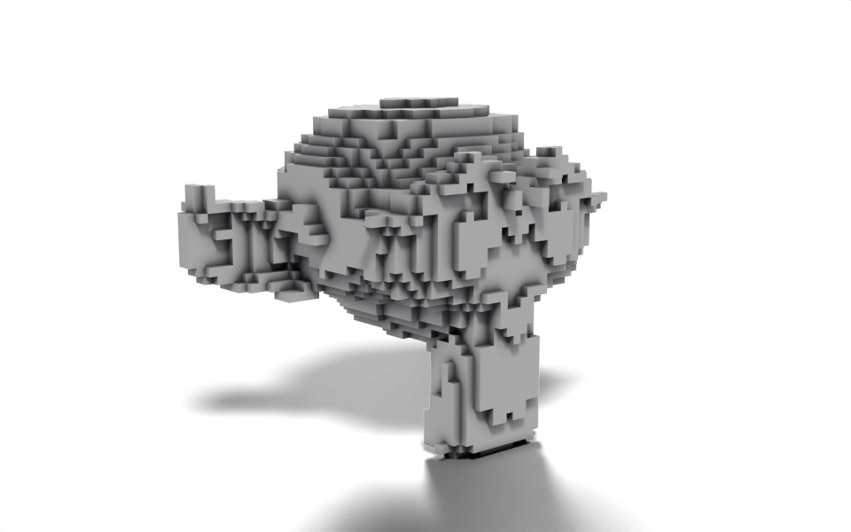

# Voxelize

Geometry Script

volumes

instancing

Rebuild any mesh out of cubes by sampling a volume on a regular grid.



Suzanne rebuilt from 5 cm cubes.

The mesh is turned into a volume, the volume is sampled with points on a regular grid, and a cube is placed on each point. Because every step takes one geometry and hands one on, the whole tree is a single `>>` chain from the group input to the group output.

``` python
from nodebpy import geometry as g

with g.tree("Voxelize", is_modifier=True) as tree:
    geometry = tree.inputs.geometry("Geometry")
    size = tree.inputs.float("Voxel Size", 0.2, min_value=0.01, subtype="DISTANCE")
    material = tree.inputs.material("Material")

    voxel = g.Cube(size=size) >> g.SetMaterial(material=material)

    (
        geometry
        >> g.MeshToVolume(interior_band_width=size)
        >> g.DistributePointsInVolume(mode="Grid", spacing=size)
        >> g.InstanceOnPoints(instance=voxel)
        >> tree.outputs.geometry("Geometry")
    )
```

## How it works

- **Mesh to Volume** builds a volume from the mesh. `interior_band_width` controls how far inwards from the surface the volume extends, so tying it to the voxel size keeps a shell one voxel thick rather than filling the whole interior. The cubes inside would never be seen.
- **Distribute Points in Volume** in `"Grid"` mode puts a point at every grid cell inside the volume. `spacing` is a vector socket, and the single `size` float is broadcast to all three axes.
- **Instance on Points** places a cube of the same size on each point, so neighbouring cubes meet exactly.
- The cube is given the material from the `Material` input. Geometry made inside a tree has no material of its own, so without Set Material the voxels would render with Blender’s default surface even when the object has a material.

Interface inputs are declared with `tree.inputs`, and the returned socket is used like any other output: `size` feeds three different nodes here. The `Voxel Size` input carries `min_value` and a `"DISTANCE"` subtype so the modifier panel shows it in scene units and refuses a size of zero.

## Node tree

## Original

Ported from the [Voxelize tutorial](https://carson-katri.github.io/geometry-script/tutorials/voxelize.html) in Geometry Script, which chains the same three nodes as methods on a geometry: `geometry.mesh_to_volume(...).distribute_points_in_volume(...).instance_on_points(...)`. In `nodebpy` the chain is written with `>>` between node classes, which keeps the node names exactly as they appear in Blender’s Add menu.
