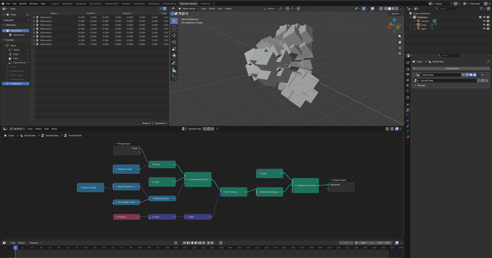

# nodebpy

[](https://github.com/BradyAJohnston/nodebpy/actions/workflows/tests.yml) [](https://codecov.io/gh/BradyAJohnston/nodebpy)

A package to build node trees in blender more elegantly with python code. Geometry Nodes, Shader Nodes and Compositor nodes are all fully supported.

[Video](images/example.mp4)

A screen-recording of nodebpy in action. Live-editing geometry, shader and compostior node trees while each updates in the Blender GUI

## Creating Nodes With Code

> A text-based version of nodes should bring the convenience of writing code with IDE auto-completion, type hinting, with overall compactness and readability, while staying as close as possible to what building a node tree via the GUI feels like.

``` python
from nodebpy import geometry as g

with g.tree("AnotherTree", collapse=True) as tree:
    rotation = (
        g.RandomValue.vector(min=-1, seed=2)
        >> g.AlignRotationToVector()
        >> g.RotateRotation(rotate_by=g.AxisAngleToRotation(angle=0.3))
    )

    _ = (
        tree.inputs.integer("Count", 10)
        >> g.Points(position=g.RandomValue.vector(min=-1))
        >> g.InstanceOnPoints(instance=g.Cube(), rotation=rotation)
        >> g.SetPosition(
            position=g.Position() * 2.0 + (0, 0.2, 0.3),
            offset=(0, 0, 0.1),
        )
        >> g.RealizeInstances()
        >> g.InstanceOnPoints(g.Cube(), instance=...)
        >> tree.outputs.geometry("Instances")
    )
```



Nodes are created by instantiating their classes. The node tree they are added to is determined by the context the code is executed in (while inside `with g.tree():`). The interface for the node tree is created with `tree.inputs` and `tree.inputs`, adding the sockets and returning the input or output socket for linking with other nodes.

Nodes are linked by overloading the `>>` operator, to link from the previous node on the left to the input on the right. Suitable socket pairs are automatically selected or explicitly supplied.

The layout / arrangement of the node tree is not important to Blender’s evaluation of it - but an automatic layout algorithm is potentially applied upon exiting the node tree context.

### `nodebpy` and the `>>` operator

In `nodebpy` we use the `>>` operator to link from one node or socket into another. This should feel and behave much like the Alt + Right Click drag between nodes in [Node Wrangler](https://docs.blender.org/manual/en/latest/addons/node/node_wrangler.html). It will use some smart logic to match the most compatible sockets between the nodes, but if you ever want to be explicit you do so. The input and output sockets of a node are accessible as properties via the `i.*` and `o.*` prefixes, or you can use the `...` placeholder to specify the particular input to be user, or pass in the previous node as a named argument.

``` py
# vector output will be linked into the first vector input (position)
g.Vector() >> g.SetPosition()
# vector output will be linked into the offset input
g.Vector() >> g.SetPosition(offset=...)
g.SetPosition(offset=g.Vector())
```

The `>>` operator will always look for the *most* compatible sockets first (matching data types) before looking for other compatible but not identical socket data types to link. If a compatible match can’t be found an error *will* be thrown.

### Contexts

What node tree or node tree interface we are currently editing is determined based on contexts. Instantiating a node class outside of a tree context will throw an error. The easiest way to enter and exit a tree context is to use the `with` statement.

Each time you instantiate a node class, a new node will be created and added to the current tree. If these nodes are given as arguments to other nodes or used with the `>>` operator, they will be automatically linked to the appropriate sockets.

## Nodes

Documentation for all of the nodes can be found in the [API Reference](https://bradyajohnston.github.io/nodebpy/reference/). This is mostly built automatically from the existing Blender node classes.

Every node has all of it’s input sockets and enum options exposed as arguments to the class constructor. Input sockets are prefixed with `.i.*` and output sockets are prefixed with `.o.*`. Properties that aren’t exposed as sockets are available as class properties. Many properties are also available as class methods for convenience when constructing.

The basic math operators also automatically add relevant nodes with their operations and values set.

``` py
# operation is exposed as a property
math = g.Math(1.0, 2.0, operation='ADD')
math.operation = "SUBTRACT"

# operation can be chose as a class method
math = g.Math.subtract(1.0, 2.0)
math = g.Value(1.0) - 2.0
math = g.Math.add(1.0, 2.0)
math = g.Value(1.0) + 2.0
# the 3.0 + 2.0 is evaluated as regular python code first,
# so the result with be a Math.add(g.Value(1.0), 5.0)
math = g.Value(1.0) 3.0 + 2.0

# these are equivalent, the g.Math.multiply is automatically added
g.Value(1.0) * 2
g.Math.multiply(g.Value(1.0), 2.0)
```

# Design Considerations

The top priority of `nodebpy` has been type hinting and IDE auto-complete. Typical tooling that supports autoring regular python code should also support the authoring of node trees. Much like [`databpy`](https://github.com/BradyAJohnston/databpy), this started as an internal tool used inside of [`molecularnodes`](https://github.com/BradyAJohnston/molecularnodes) but has since been broken out into it’s own separate project. This projects is robustly typed and tested, with the intent that it can be used internally for multiple other add-ons and projects.

- Node classes are named after nodes ‘Random Value’ -\> `RandomValue()`
- Node ‘subtypes’ and methods should be accessible via dot (`.`) for easier IDE auto-complete and authoring:
  - `RandomValue(data_type="FLOAT_VECTOR")` -\> `RandomValue.vector()`
- Node properties are available on the top level, with inputs and outputs available behind `.i.*` and `.o.*` accessors
- Inputs and outputs from a node are prefixed with `i.*` and `o.*`:
  - `AccumulateField().o.total` returns the output `Total` socket
  - `AccumulateField().i.value` returns the input `Value` socket

## Building

Most of the code for classes are generated automatically with the `generate.py` script. Some nodes are manually specified in the `src/nodebpy/nodes/geometry/manual.py` if they require special handling.

Run the build & format script as such:

``` bash
uv run generate.py && uvx ruff format && uvx ruff check --fix
```

## Other Projects

There are several other notable projects which have also attempted interfacing with node trees via code. They mostly fit into two categories of either storing & retrieving node trees via code (`.json` or the `bpy` API), or authoring of node trees with custom API and syntax. This project mostly fits in to the latter category.

### Storing node trees as code:

Converting node trees to the python API calls or `.json` is great to have a robust storage method, but this approach falls down in human authorability / readability. These projects are great for storage but less useful when wanting to write / generate node trees froms scratch.

- [NodeToPython](https://github.com/BrendanParmer/NodeToPython)
- [TreeClipper](https://github.com/Algebraic-UG/tree_clipper) (used by this project for running tests & snapshots)

### Authoring node trees with code:

Two previous projects have made similar approaches to authoring node trees. `geometry-script` also auto-generated most of it’s type hinting, code and docs. It uses the approach of method chaining with the `.` operator, but obfuscates some of the non-linear way of building node trees.

The other project `geonodes` uses a similar context system for creating and authoring node trees, but doesn’t use the same method of exposing each individual node as it’s own class that `nodebpy` does.

I personally found both of their APIs to *not quite* fit how I wanted to work, leading to the creation of `nodebpy`. In comparison, this project is also the only one that is also distributed on `PyPi` and insallable via `pip` for easier use in other projects.

- [geometry-script](https://github.com/carson-katri/geometry-script),
- [geonodes](https://github.com/al1brn/geonodes)
