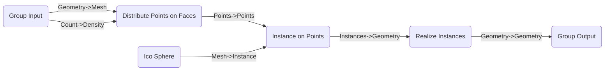
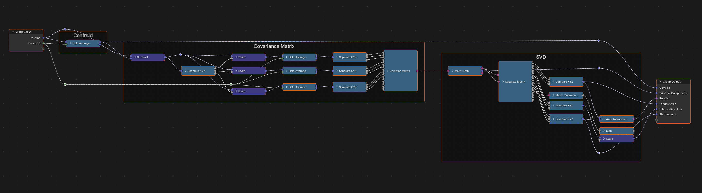
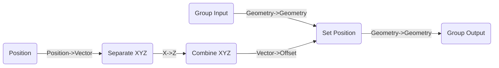

# Nodes to Code

Turn existing node trees back into `nodebpy` code.

Every `nodebpy` tree can be written *back out* as Python source. `TreeBuilder.to_python()` (or the standalone `nodebpy.export.to_python()`) inspects a node tree and generates readable `nodebpy` code that recreates it — including the interface sockets, node properties, links, zones and frames.

This works on *any* node tree, not just ones built with `nodebpy`. A tree you wired up by hand in the Blender UI, appended from an asset library, or created with raw `bpy` calls can all be converted, making it easy to migrate existing node setups into version-controlled Python code.

## Simple Example

Here we build a tree with the raw `bpy` API, standing in for a tree that already exists in a `.blend` file:

``` python
import bpy

nt = bpy.data.node_groups.new("Scatter", "GeometryNodeTree")
iface = nt.interface
iface.new_socket("Geometry", in_out="INPUT", socket_type="NodeSocketGeometry")
count = iface.new_socket("Count", in_out="INPUT", socket_type="NodeSocketInt")
count.default_value = 100
iface.new_socket("Geometry", in_out="OUTPUT", socket_type="NodeSocketGeometry")

n_in = nt.nodes.new("NodeGroupInput")
n_out = nt.nodes.new("NodeGroupOutput")
dist = nt.nodes.new("GeometryNodeDistributePointsOnFaces")
inst = nt.nodes.new("GeometryNodeInstanceOnPoints")
sphere = nt.nodes.new("GeometryNodeMeshIcoSphere")
real = nt.nodes.new("GeometryNodeRealizeInstances")

nt.links.new(n_in.outputs["Geometry"], dist.inputs["Mesh"])
nt.links.new(n_in.outputs["Count"], dist.inputs["Density"])
nt.links.new(dist.outputs["Points"], inst.inputs["Points"])
nt.links.new(sphere.outputs["Mesh"], inst.inputs["Instance"])
nt.links.new(inst.outputs["Instances"], real.inputs["Geometry"])
nt.links.new(real.outputs["Geometry"], n_out.inputs["Geometry"])
```

    bpy.data.node_groups['Scatter']...NodeLink



Pass the `bpy` node tree to `to_python()`:

``` python
from nodebpy.export import to_python

code = to_python(nt)
```

``` python
from nodebpy import geometry as g, TreeBuilder

with TreeBuilder("Scatter") as tree:
    geometry = tree.inputs.geometry("Geometry")
    count = tree.inputs.integer("Count", 100)
    geometry_1 = tree.outputs.geometry("Geometry")

    (
        geometry
        >> g.DistributePointsOnFaces(density=count)
        >> g.InstanceOnPoints(instance=g.IcoSphere())
        >> g.RealizeInstances()
        >> geometry_1
    )
```

Twenty lines of `bpy` plumbing become a single `>>` pipeline. The generated source is self-contained — running it recreates the tree.

## Complex Example

This is a new node group asset in Blender 5.2 to do PCA on the positions of points. Two examples of this node group below, with the generated and the human-curated / written versions below. More through and elegance can be put into the human-written version, but the generated version can be improved with time.



## Generated

``` python
from nodebpy import geometry as g, TreeBuilder

with TreeBuilder("Principal Components") as tree:
    position = tree.inputs.vector("Position", (0.0, 0.0, 0.0), default_input="POSITION")
    group_id = tree.inputs.integer(
        "Group ID",
        0,
        description="An index used to group values together for multiple separate operations",
        hide_value=True,
    )
    group_center = tree.outputs.vector("Group Center")
    principal_components = tree.outputs.vector(
        "Principal Components",
        description="Variance of the data along each principal axis",
    )
    rotation = tree.outputs.rotation(
        "Rotation", description="Rotation that defines the principal component basis"
    )
    with tree.outputs.panel("Principal Axes", default_closed=True):
        longest_axis = tree.outputs.vector("Longest Axis")
        intermediate_axis = tree.outputs.vector("Intermediate Axis")
        shortest_axis = tree.outputs.vector("Shortest Axis")

    with g.Frame("Centroid"):
        field_average = position.point.mean(group_id)
    with g.Frame("Covariance Matrix"):
        vector_math = position - field_average
        mean = (vector_math * vector_math.x).point.mean(group_id)
        mean_1 = (vector_math * vector_math.y).point.mean(group_id)
        mean_2 = (vector_math * vector_math.z).point.mean(group_id)
        combine_matrix = g.CombineMatrix(
            column_1_row_1=mean.x,
            column_1_row_2=mean.y,
            column_1_row_3=mean.z,
            column_2_row_1=mean_1.x,
            column_2_row_2=mean_1.y,
            column_2_row_3=mean_1.z,
            column_3_row_1=mean_2.x,
            column_3_row_2=mean_2.y,
            column_3_row_3=mean_2.z,
        )
    with g.Frame("SVD"):
        matrix_svd = combine_matrix.o.matrix.svd()
        separate_matrix = g.SeparateMatrix(matrix=matrix_svd.u)
        combine_xyz = g.CombineXYZ(
            x=separate_matrix,
            y=separate_matrix.o.column_1_row_2,
            z=separate_matrix.o.column_1_row_3,
        )
        combine_xyz_1 = g.CombineXYZ(
            x=separate_matrix.o.column_2_row_1,
            y=separate_matrix.o.column_2_row_2,
            z=separate_matrix.o.column_2_row_3,
        )
        combine_xyz_2 = g.CombineXYZ(
            x=separate_matrix.o.column_3_row_1,
            y=separate_matrix.o.column_3_row_2,
            z=separate_matrix.o.column_3_row_3,
        )
        axes_to_rotation = g.AxesToRotation(
            primary_axis=combine_xyz, secondary_axis=combine_xyz_2
        )
        combine_xyz_1.o.vector * matrix_svd.u.determinant().sign() >> intermediate_axis

    field_average >> group_center
    matrix_svd.s >> principal_components
    axes_to_rotation >> rotation
    combine_xyz >> longest_axis
    combine_xyz_2 >> shortest_axis
```

## Human-written

``` python
from nodebpy import geometry as g

with g.tree():
    position = tree.inputs.vector("Position", default_input="POSITION")
    group_id = tree.inputs.integer(
        "Group ID",
        description="An index used to group values together for multiple separate operations",
        hide_value=True
    )
    out_centroid = tree.outputs.vector("Centroid")
    out_princ = tree.outputs.vector(
        "Principal Components",
        description="Variance of the data along each principal axis",
    )
    out_rotation = tree.outputs.rotation(
        "Rotation",
        description="Rotation that defines the principal component basis",
    )
    with tree.outputs.panel("Principal Axes", default_closed=True):
        out_long = tree.outputs.vector("Longest Axis")
        out_inter = tree.outputs.vector("Intermediate Axis")
        out_short = tree.outputs.vector("Shortest Axis")

    with g.Frame("Centroid"):
        centroid = position.point.mean(group_id)
        centroid >> out_centroid

    with g.Frame("Covariance Matrix"):
        diff = position - centroid
        matrix = g.CombineMatrix()

        for i, axis1 in enumerate(diff):
            mean = (diff * axis1).point.mean(group_id)
            for j, axis2 in enumerate(mean):
                axis2 >> matrix.i[int(i * 4 + j)]

    with g.Frame("SVD"):
        u, s, v = matrix.o.matrix.svd()
        s >> out_princ
        long, inter, short = [g.CombineXYZ(*u[i * 4 : (i * 4) + 3]) for i in range(3)]
        long >> out_long
        short >> out_short
        g.AxesToRotation(long, short) >> out_rotation
        inter * u.determinant().sign() >> out_inter
```

## From a `TreeBuilder`

Trees built with `nodebpy` have a `to_python()` method directly. The generator recognises lifted operators, so math written with Python syntax comes back out the same way:

``` python
from nodebpy import TreeBuilder
from nodebpy import geometry as g

with TreeBuilder("Wave Deform") as tree:
    geo = tree.inputs.geometry("Geometry")
    amp = tree.inputs.float("Amplitude", 0.5, min_value=0.0)
    out = tree.outputs.geometry("Geometry")
    height = g.Math.sine(g.Position().o.position.x) * amp
    geo >> g.SetPosition(offset=g.CombineXYZ(z=height)) >> out

code = tree.to_python()
```

``` python
from nodebpy import geometry as g, TreeBuilder

with TreeBuilder("Wave Deform") as tree:
    geometry = tree.inputs.geometry("Geometry")
    amplitude = tree.inputs.float("Amplitude", 0.5, min_value=0.0)
    geometry_1 = tree.outputs.geometry("Geometry")

    (
        geometry
        >> g.SetPosition(
            offset=g.CombineXYZ(
                z=g.Math.sine(g.Position().o.position.x).o.value * amplitude
            )
        )
        >> geometry_1
    )
```

Note what happened to the math: the `Math` node set to `SINE` becomes `g.Math.sine(...)`, the multiply node becomes the `*` operator, and the `Separate XYZ` node dissolves into `.x` attribute access. Interface sockets are declared with their non-default settings (`min_value=0.0`) preserved.

## Tuning the Output

### Chain length

Linear runs of nodes are emitted as `>>` pipelines when they have at least `min_chain_length` items (default 3, counting interface endpoints). Raising the threshold produces flat assignments instead:

``` python
code = tree.to_python(min_chain_length=99)
```

``` python
from nodebpy import geometry as g, TreeBuilder

with TreeBuilder("Wave Deform") as tree:
    geometry = tree.inputs.geometry("Geometry")
    amplitude = tree.inputs.float("Amplitude", 0.5, min_value=0.0)
    geometry_1 = tree.outputs.geometry("Geometry")

    set_position = g.SetPosition(
        geometry=geometry,
        offset=g.CombineXYZ(
            z=g.Math.sine(g.Position().o.position.x).o.value * amplitude
        ),
    )

    set_position >> geometry_1
```

### Inline width

`max_inline_width` (default 88) limits how long an expression may grow before it is bound to a variable instead of inlining into its consumer. Deeply nested graphs split into named steps rather than collapsing into one huge statement; pass `None` to disable the budget.

### Node positions

By default the generated code lets `nodebpy` lay the tree out automatically when it is built. Pass `snapshot_positions=True` to instead capture each node’s authored `location` and restore it, so the rebuilt tree matches the original layout. The tree is built with `arrange=None` (auto-layout off) and a `tree.node_positions = {...}` mapping is appended:

``` python
with TreeBuilder("Wave Deform", arrange=None) as tree:
    geo = tree.inputs.geometry("Geometry")
    out = tree.outputs.geometry("Geometry")
    geo >> g.SetPosition(offset=g.CombineXYZ(z=g.Position().o.position.x)) >> out

code = tree.to_python(snapshot_positions=True)
```

``` python
from nodebpy import geometry as g, TreeBuilder

with TreeBuilder("Wave Deform.001", arrange=None) as tree:
    geometry = tree.inputs.geometry("Geometry")
    geometry_1 = tree.outputs.geometry("Geometry")

    (
        geometry
        >> g.SetPosition(offset=g.CombineXYZ(z=g.Position().o.position.x))
        >> geometry_1
    )

# Restore authored node positions.
tree.node_positions = {
    "Group Input": (0.0, 0.0),
    "Group Output": (0.0, 0.0),
    "Position": (0.0, 0.0),
    "Separate XYZ": (0.0, 0.0),
    "Combine XYZ": (0.0, 0.0),
    "Set Position": (0.0, 0.0),
}
```

Positions are applied by name, so a node a rebuild does not recreate (a reroute) or renames is skipped rather than erroring. Positions inside nested groups are preserved too.

### Reroutes

Reroute nodes are pure wire-routing aids, so by default each reroute chain is collapsed into a direct link. Pass `keep_reroutes=True` to preserve them as `g.Reroute(...)` pass-throughs — useful together with `snapshot_positions` to reproduce the original wire routing exactly.

### Formatting

When the optional [`ruff`](https://docs.astral.sh/ruff/) package is installed (`pip install nodebpy[format]`), the generated source is run through `ruff format` for tidier output — for example wrapping long lines the generator left on one line. This is on by default; pass `format=False` to get the raw generator output, and it is a no-op when `ruff` is not installed.

## Zones

Simulation, repeat and for-each zones are reconstructed using the zone item API rather than as raw input/output node pairs:

``` python
with TreeBuilder("Stack") as tree:
    out = tree.outputs.geometry("Geometry")
    zone = g.RepeatZone(5)
    geo = zone.item("Geometry", g.Cube())
    (geo.current >> g.TransformGeometry(translation=(0, 0, 1.1))) >> geo.next
    geo.result >> out

code = tree.to_python()
```

``` python
from nodebpy import geometry as g, TreeBuilder

with TreeBuilder("Stack") as tree:
    geometry = tree.outputs.geometry("Geometry")

    repeat_zone = g.RepeatZone(5)
    geometry_1 = repeat_zone.item("Geometry", g.Cube().o.mesh)
    (
        g.TransformGeometry(geometry=geometry_1.current, translation=(0.0, 0.0, 1.1))
        >> geometry_1.next
    )

    geometry_1.result >> geometry
```

## Frames

Frames are reconstructed as `with g.Frame("..."):` blocks, including frames nested inside other frames (and container frames that hold only sub-frames):

``` python
with TreeBuilder("Framed") as tree:
    geo = tree.inputs.geometry("Geometry")
    with g.Frame("Deform"):
        with g.Frame("Warp"):
            warped = geo >> g.SetPosition(offset=(0.0, 0.0, 1.0))
    warped >> g.SetShadeSmooth() >> tree.outputs.geometry("Out")

code = tree.to_python()
```

``` python
from nodebpy import geometry as g, TreeBuilder

with TreeBuilder("Framed") as tree:
    geometry = tree.inputs.geometry("Geometry")
    out = tree.outputs.geometry("Out")

    with g.Frame("Deform"):
        with g.Frame("Warp"):
            set_position = geometry >> g.SetPosition(offset=(0.0, 0.0, 1.0))
    set_position >> g.SetShadeSmooth() >> out
```

## Archiving as Classes

By default the top-level tree is emitted as a `with TreeBuilder(...) as tree:` block. Pass `top_level="class"` to instead emit *every* node group — including the one being exported — as a [`CustomGeometryGroup`](custom-node-groups.llms.md) subclass. Each class builds its tree through `ClassName.create_group()`, making it a clean way to archive a set of node groups as plain, reusable Python:

``` python
with TreeBuilder("Wave Deform") as tree:
    geo = tree.inputs.geometry("Geometry")
    out = tree.outputs.geometry("Geometry")
    geo >> g.SetPosition(offset=g.CombineXYZ(z=g.Position().o.position.x)) >> out

code = tree.to_python(top_level="class")
```

``` python
from nodebpy import geometry as g
from nodebpy.builder import CustomGeometryGroup


class WaveDeform002(CustomGeometryGroup):
    _name = "Wave Deform.002"

    def _build_group(self, tree):
        geometry = tree.inputs.geometry("Geometry")
        geometry_1 = tree.outputs.geometry("Geometry")

        (
            geometry
            >> g.SetPosition(offset=g.CombineXYZ(z=g.Position().o.position.x))
            >> geometry_1
        )
```

Build any of the resulting classes with `create_group()`, which returns the node tree without needing an active `TreeBuilder` context:

``` python
WaveDeform.create_group()   # -> bpy.types.GeometryNodeTree
```

## Unsupported Nodes

If a node has no `nodebpy` class and no registered emitter, `to_python()` raises `CodegenError` by default. Pass `strict=False` to emit a placeholder and keep going:

``` python
to_python(node_tree, strict=False)
# ...
# some_node = None  # TODO: unsupported node 'Some Node' (SomeNodeIdname)
```

Alternatively, register a custom emitter for the node type. The decorated function receives the `bpy` node and an emit context, and returns an expression (or `None` to fall back to the default emission):

``` python
from nodebpy.export.codegen import register_emitter, Call

@register_emitter("GeometryNodeSetShadeSmooth")
def _emit_shade_smooth(node, ctx):
    if node.domain == "FACE":
        return Call("g.SetShadeSmooth.face")
    return None
```

## Round-Tripping

In the default `with` form the generated source assigns the builder to a variable named `tree`, so it can be executed directly to rebuild the tree:

``` python
namespace = {}
exec(tree.to_python(), namespace)
rebuilt = namespace["tree"]
rebuilt
```



(With `top_level="class"` there is no `tree` variable — call the generated class’s `create_group()` instead.)

Because `to_python()` output is itself valid `nodebpy` code, converting a tree, running the result, and converting again produces identical source — handy for snapshotting node trees in tests or committing them to version control. The generator is validated against Blender’s full bundled geometry, shader and compositor essentials asset libraries, so it handles real-world trees, not just ones built with `nodebpy`.
